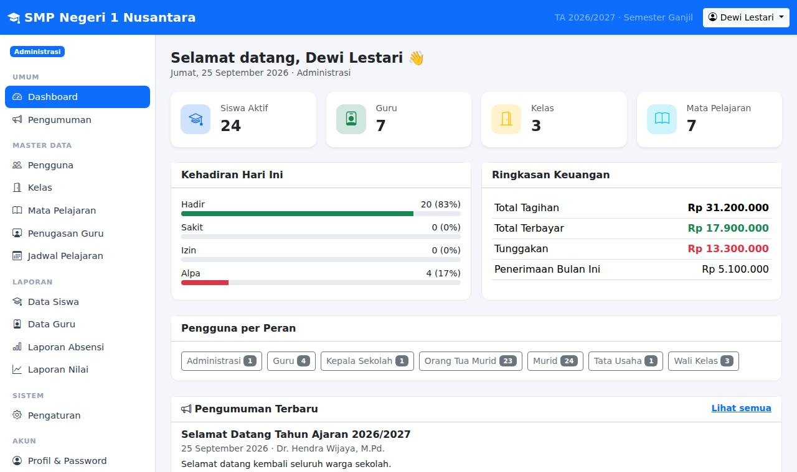

# SIAKAD Sekolah

Aplikasi web Sistem Informasi Akademik & Administrasi Sekolah dengan 7 tipe pengguna:
**Murid, Guru, Wali Kelas, Orang Tua Murid, Administrasi, Kepala Sekolah, dan Tata Usaha**.

Dibangun dengan PHP 8.1+ native (tanpa framework / Composer), PDO, dan Bootstrap 5 (disertakan secara lokal,
jadi tetap berjalan di jaringan sekolah tanpa internet). Database utama **MySQL/MariaDB** (XAMPP, Laragon,
shared hosting); **SQLite** tersedia sebagai alternatif tanpa server database.



## Dokumentasi

Tersedia dalam format **PDF** (siap cetak/dibagikan) di folder [`docs/pdf/`](docs/pdf/) dan Markdown:

| Dokumen | PDF | Isi |
|---|---|---|
| 📚 **Dokumentasi Lengkap** | [SIAKAD-Dokumentasi-Lengkap.pdf](docs/pdf/SIAKAD-Dokumentasi-Lengkap.pdf) | Gabungan keempat dokumen di bawah |
| 💻 [**Instalasi di XAMPP**](docs/INSTALASI-XAMPP.md) | [PDF](docs/pdf/SIAKAD-Panduan-Instalasi-XAMPP.pdf) | Menjalankan di komputer sendiri (localhost) tanpa internet, instalasi database otomatis lewat browser, akses dari jaringan sekolah |
| 📘 [**Instalasi di cPanel**](docs/INSTALASI-CPANEL.md) | [PDF](docs/pdf/SIAKAD-Panduan-Instalasi-cPanel.pdf) | Langkah demi langkah lewat browser: versi PHP, database, phpMyAdmin, upload, SSL, backup otomatis, pemecahan masalah |
| 👥 [**Panduan Pengguna**](docs/PANDUAN-PENGGUNA.md) | [PDF](docs/pdf/SIAKAD-Panduan-Pengguna.pdf) | Cara memakai aplikasi untuk setiap peran, dilengkapi tangkapan layar |
| 🛠 [**Dokumentasi Teknis**](docs/DOKUMENTASI-TEKNIS.md) | [PDF](docs/pdf/SIAKAD-Dokumentasi-Teknis.pdf) | Arsitektur, konfigurasi, skema database (ERD), hak akses, daftar rute, aturan bisnis, cara menambah fitur |

Setelah mengubah file Markdown di `docs/`, bangun ulang PDF dengan:

```bash
cd tools/docs-pdf
npm install
npx playwright install chromium   # sekali saja, mengunduh Chromium
npm run build                    # hasil: docs/pdf/*.pdf
```

## Fitur per Peran

| Peran | Fitur |
|---|---|
| **Administrasi** | Kelola pengguna semua peran (termasuk data murid: NIS, kelas, orang tua), kelas & wali kelas, mata pelajaran & KKM, penugasan guru pengampu, jadwal pelajaran (dengan deteksi bentrok kelas/guru), pengaturan sekolah & tahun ajaran/semester aktif, laporan, pengumuman |
| **Kepala Sekolah** | Dashboard statistik sekolah, data siswa & guru, laporan absensi per kelas (+ siswa sering alpa), laporan rata-rata nilai per kelas/mapel, laporan keuangan, arsip surat, buat pengumuman, lihat rapor siswa |
| **Tata Usaha** | Buat tagihan (per siswa / per kelas / semua siswa), catat pembayaran (cicilan, validasi tidak melebihi sisa), cetak kwitansi, laporan keuangan per kelas & per metode, arsip surat masuk/keluar, data siswa & guru, pengumuman |
| **Guru** | Jadwal mengajar, input absensi harian kelas yang diajar, input nilai (Tugas, UTS, UAS → nilai akhir & predikat otomatis) |
| **Wali Kelas** | Semua fitur guru + daftar siswa perwalian (kontak orang tua, rekap kehadiran, tunggakan), rekap absensi bulanan, rekap nilai & peringkat kelas, catatan wali kelas untuk rapor, lihat/cetak rapor |
| **Murid** | Dashboard, jadwal pelajaran, nilai & rapor (bisa dicetak), riwayat kehadiran, tagihan & riwayat pembayaran + kwitansi, pengumuman |
| **Orang Tua** | Sama seperti murid untuk anaknya; mendukung **lebih dari satu anak** (pilih anak di bagian atas halaman) |

Pengumuman bisa ditujukan ke semua pengguna atau peran tertentu.

## Menjalankan di XAMPP (localhost, tanpa internet)

1. Ekstrak aplikasi ke `C:\xampp\htdocs\siakad`.
2. XAMPP Control Panel → **Start** Apache dan MySQL.
3. Buka **http://localhost/siakad** → otomatis diarahkan ke halaman instalasi → pilih *Data contoh* atau
   *Database kosong* → **Pasang Database** → login.

Panduan lengkap: **[docs/INSTALASI-XAMPP.md](docs/INSTALASI-XAMPP.md)**.

## Menjalankan (MySQL / MariaDB)

Tersedia dua file database MySQL siap import di folder `database/`:

| File | Isi |
|---|---|
| **`sekolah_mysql.sql`** | Skema + data dummy: 57 pengguna, 3 kelas, 7 mapel, 42 jadwal, 480 absensi, 168 nilai, 80 tagihan, 55 pembayaran, pengumuman, arsip surat, catatan rapor (password semua akun `password123`) |
| **`sekolah_mysql_kosong.sql`** | Skema + 1 akun `admin` / `admin12345` — untuk penggunaan nyata |

### Opsi A — Import file SQL (phpMyAdmin / XAMPP)

1. Buka phpMyAdmin → buat database **`sekolah`** dengan collation `utf8mb4_unicode_ci`.
2. Pilih database `sekolah` → tab **Import** → pilih `database/sekolah_mysql.sql` → **Go**.
3. Sesuaikan koneksi di `config.php` bila perlu (default: host `127.0.0.1`, user `root`, password kosong,
   database `sekolah` — sama dengan default XAMPP).

Atau lewat command line:

```bash
mysql -u root -p -e "CREATE DATABASE sekolah CHARACTER SET utf8mb4 COLLATE utf8mb4_unicode_ci"
mysql -u root -p sekolah < database/sekolah_mysql.sql
```

### Opsi B — Installer (data dummy dibuat ulang dengan tanggal hari ini)

```bash
php database/install.php --demo          # skema + data dummy
php database/install.php --demo --fresh  # hapus semua tabel lama lalu pasang ulang
php database/install.php                 # skema kosong + akun admin (password acak ditampilkan)
```

Kredensial dapat diberikan via environment variable, mis.
`DB_HOST=127.0.0.1 DB_NAME=sekolah DB_USER=root DB_PASS=rahasia php database/install.php --demo`.

### Menjalankan aplikasi

```bash
php -S localhost:8000 -t public
```

Buka http://localhost:8000 (di XAMPP: salin folder proyek ke `htdocs/` lalu buka
http://localhost/nama-folder/). Semua akun dummy memakai password **`password123`**:

| Peran | Username |
|---|---|
| Administrasi | `admin` |
| Kepala Sekolah | `kepsek` |
| Tata Usaha | `tu` |
| Guru | `guru1` … `guru4` |
| Wali Kelas | `walikelas1` (VII-A), `walikelas2` (VII-B), `walikelas3` (VIII-A) |
| Murid | `siswa1` … `siswa24` |
| Orang Tua | `ortu1` (punya 2 anak) … `ortu23` |

> Segera ganti password akun-akun ini (atau pasang tanpa `--demo`) sebelum dipakai sungguhan.

### Alternatif: SQLite (tanpa server database)

```bash
DB_DRIVER=sqlite php database/install.php --demo
DB_DRIVER=sqlite php -S localhost:8000 -t public
```

Atau ubah `'driver'` menjadi `'sqlite'` di `config.php`.

### Deploy ke cPanel / shared hosting

Ikuti panduan lengkap **[docs/INSTALASI-CPANEL.md](docs/INSTALASI-CPANEL.md)**. Ringkasnya:

1. Pilih PHP ≥ 8.1, buat database + user MySQL, import `database/sekolah_mysql_kosong.sql` via phpMyAdmin.
2. Upload & ekstrak aplikasi. Pilih salah satu: subdomain dengan document root `public/` (disarankan), atau
   langsung di `public_html` — `.htaccess` bawaan meneruskan permintaan ke `public/` dan memblokir akses ke
   `app/`, `database/`, `config*.php`, serta file `.sql`.
3. Salin `config.local.example.php` menjadi `config.local.php` dan isi kredensial database.
4. Login `admin` / `admin12345`, lalu segera ganti password.

## Aturan Penilaian

- Nilai akhir = Tugas 30% + UTS 30% + UAS 40% (atur di `config.php` → `grade_weights`).
  Komponen yang belum diisi tidak dihitung sebagai 0; bobot dinormalisasi ke komponen yang sudah ada.
- Predikat: A ≥ 90, B ≥ 80, C ≥ 70, D < 70. Tuntas bila nilai akhir ≥ KKM mata pelajaran.
- Nilai & catatan rapor disimpan per tahun ajaran + semester aktif (diatur di menu Pengaturan).

## Keamanan

Detail di [Dokumentasi Teknis § Keamanan](docs/DOKUMENTASI-TEKNIS.md#9-keamanan).

- Password di-hash (`password_hash`), pembatasan percobaan login, regenerasi session ID saat login.
- Token CSRF pada setiap form POST, semua query memakai prepared statement, output di-escape.
- Kontrol akses per rute berdasarkan peran, plus pengecekan kepemilikan data (murid hanya melihat datanya
  sendiri, orang tua hanya anaknya, wali kelas hanya kelas perwaliannya, guru hanya kelas yang diajar).
- Cookie session `HttpOnly` + `SameSite=Lax`; set `APP_DEBUG=false` (default) di produksi.

## Struktur

```
public/            # document root: index.php (front controller) & assets/
app/
  bootstrap.php    # memuat konfigurasi & helper
  routes.php       # daftar rute + peran yang diizinkan
  menu.php         # menu sidebar per peran
  auth.php access.php helpers.php db.php
  controllers/     # admin, guru, walikelas, siswa, keuangan, surat, laporan, data, pengumuman, dashboard
  views/           # template PHP
database/
  sekolah_mysql.sql        # dump MySQL siap import: skema + data dummy
  sekolah_mysql_kosong.sql # dump MySQL siap import: skema + akun admin saja
  schema.sql        # skema tabel (dipakai installer, SQLite/MySQL)
  install.php       # instalasi + data demo
docs/              # dokumentasi Markdown + tangkapan layar (img/) + versi PDF (pdf/)
tools/docs-pdf/    # pembangun PDF dokumentasi (Markdown -> PDF via Chromium)
tests/smoke_test.php
config.local.example.php  # contoh konfigurasi server -> salin menjadi config.local.php
```

## Pengujian

```bash
php tests/smoke_test.php                                   # SQLite sementara
DB_USER=root DB_PASS= php tests/smoke_test.php --mysql     # MySQL: database uji dibuat & dihapus otomatis
```

Tes ini memakai database sementara, login sebagai ketujuh peran, membuka semua menu, menguji pembatasan
akses & CSRF, serta alur utama: input nilai, absensi, catatan rapor, tagihan & pembayaran, kwitansi,
pengumuman bertarget, tambah siswa, deteksi jadwal bentrok, ganti anak (orang tua), ganti password, dan logout.
