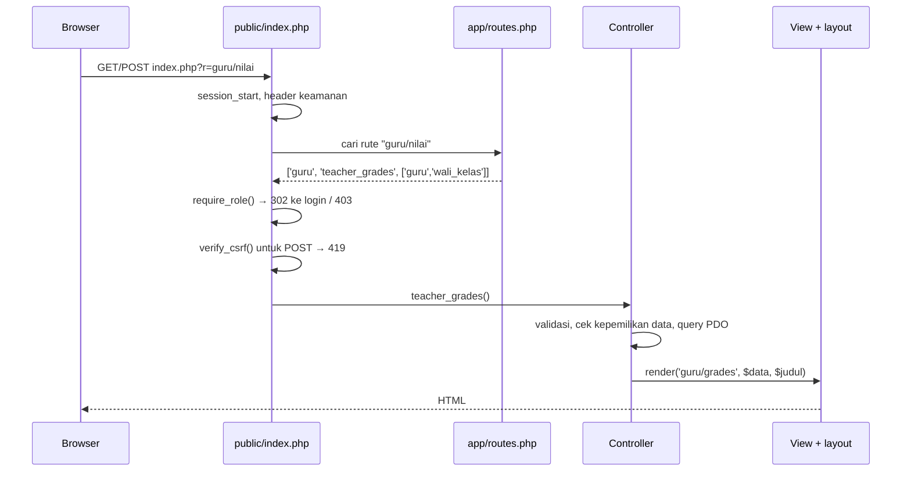
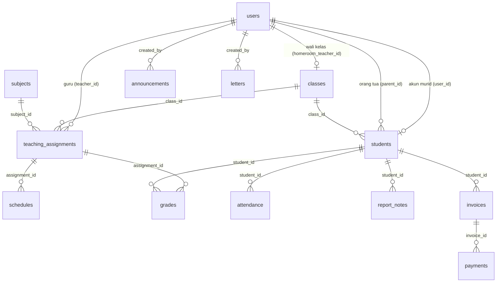

# Dokumentasi Teknis SIAKAD Sekolah

Dokumen ini untuk pengembang dan pengelola server: arsitektur, konfigurasi, struktur database,
hak akses, aturan bisnis, dan cara mengembangkan aplikasi.

## Daftar Isi

1. [Teknologi](#1-teknologi)
2. [Struktur Folder](#2-struktur-folder)
3. [Alur Permintaan](#3-alur-permintaan)
4. [Konfigurasi](#4-konfigurasi)
5. [Database](#5-database)
6. [Peran & Hak Akses](#6-peran--hak-akses)
7. [Daftar Rute](#7-daftar-rute)
8. [Aturan Bisnis](#8-aturan-bisnis)
9. [Keamanan](#9-keamanan)
10. [Pengembangan Lokal & Pengujian](#10-pengembangan-lokal--pengujian)
11. [Menambah Fitur Baru](#11-menambah-fitur-baru)

---

## 1. Teknologi

| Lapisan | Teknologi |
|---|---|
| Bahasa | PHP ≥ 8.1, tanpa framework & tanpa Composer |
| Database | MySQL 5.7+/8, MariaDB 10.3+ (utama) atau SQLite 3 (alternatif), melalui PDO |
| Antarmuka | Template PHP + Bootstrap 5.3.3 + Bootstrap Icons 1.11.3 (disimpan lokal di `public/assets/vendor/`) |
| Web server | Apache/LiteSpeed (`.htaccess`), Nginx, atau server bawaan PHP untuk pengembangan |

---

## 2. Struktur Folder

```
.
├── .htaccess                  # Meneruskan ke public/ & memblokir folder internal (instalasi di public_html)
├── index.php                  # Cadangan bila mod_rewrite mati: redirect ke public/
├── config.php                 # Konfigurasi default (bisa ditimpa env var atau config.local.php)
├── config.local.example.php   # Contoh konfigurasi server; salin menjadi config.local.php
├── public/                    # DOCUMENT ROOT
│   ├── index.php              # Front controller: cek versi PHP, session, header keamanan, routing, CSRF
│   ├── setup.php              # Instalasi database lewat browser (khusus localhost, mis. XAMPP)
│   └── assets/                # app.css + vendor/ (Bootstrap, ikon)
├── app/
│   ├── bootstrap.php          # Memuat config & semua helper
│   ├── routes.php             # Peta rute → [controller, fungsi, peran]
│   ├── menu.php               # Menu sidebar per peran
│   ├── helpers.php            # Konstanta (ROLES, DAYS…), escape, url, flash, CSRF, render, format
│   ├── db.php                 # Koneksi PDO & helper query (db_one, db_all, db_insert, db_upsert…)
│   ├── auth.php               # Login, logout, current_user, require_role
│   ├── access.php             # Aturan kepemilikan data (siapa boleh melihat siswa mana) & query domain
│   ├── controllers/           # Satu file per modul, berisi fungsi handler
│   └── views/                 # Template: layout.php + subfolder per modul + shared/
├── database/
│   ├── schema.sql             # Skema (placeholder {PK} disesuaikan per driver)
│   ├── install.php            # Installer CLI (+ data demo)
│   ├── sekolah_mysql.sql      # Dump MySQL: skema + data dummy
│   └── sekolah_mysql_kosong.sql # Dump MySQL: skema + akun admin saja
├── docs/                      # Dokumentasi
└── tests/smoke_test.php       # Tes end-to-end
```

---

## 3. Alur Permintaan



- Rute dipilih lewat parameter `r` (`index.php?r=modul/aksi`), sehingga tidak bergantung pada URL rewriting
  dan berfungsi di hosting mana pun.
- Pola **Post/Redirect/Get**: setiap POST yang berhasil memanggil `flash()` lalu `redirect()`.
- Controller tidak menulis HTML; view hanya menampilkan data dan selalu memakai `e()` untuk escape.

---

## 4. Konfigurasi

Urutan prioritas (yang terakhir menang): **`config.php`** → **environment variable** (dibaca di dalam
`config.php`) → **`config.local.php`** (digabung dengan `array_replace_recursive`).

| Kunci | Env var | Default | Keterangan |
|---|---|---|---|
| `app_name` | `APP_NAME` | `SIAKAD Sekolah` | Dipakai bila nama sekolah belum diisi di Pengaturan |
| `debug` | `APP_DEBUG` | `false` | `true` menampilkan error PHP (jangan di produksi) |
| `timezone` | — | `Asia/Jakarta` | Juga dikirim ke sesi MySQL (`SET time_zone`) |
| `db.driver` | `DB_DRIVER` | `mysql` | `mysql` atau `sqlite` |
| `db.host` / `db.port` | `DB_HOST` / `DB_PORT` | `127.0.0.1` / `3306` | Gunakan `localhost` di cPanel |
| `db.name` / `db.user` / `db.pass` | `DB_NAME` / `DB_USER` / `DB_PASS` | `sekolah` / `root` / kosong | Default XAMPP |
| `db.sqlite_path` | `DB_SQLITE_PATH` | `database/sekolah.sqlite` | Hanya untuk SQLite |
| `grade_weights` | — | `task 30, mid 30, final 40` | Bobot nilai akhir (persen) |

Pengaturan yang bisa diubah dari aplikasi (tabel `settings`, menu **Pengaturan**): `school_name`,
`school_address`, `school_phone`, `principal_name`, `principal_nip`, `academic_year`, `semester`.

---

## 5. Database

### Diagram relasi



### Tabel

| Tabel | Isi | Kunci unik / catatan |
|---|---|---|
| `settings` | Pasangan `skey` → `svalue` pengaturan sekolah | PK `skey` |
| `users` | Semua akun; `role` ∈ admin, kepala_sekolah, tata_usaha, guru, wali_kelas, siswa, orang_tua | `username` unik; `active` 0/1; `password_hash` bcrypt |
| `classes` | Kelas & wali kelas | `name` unik; wali kelas `ON DELETE SET NULL` |
| `subjects` | Mata pelajaran & KKM | `code` unik |
| `students` | Biodata murid; menghubungkan akun murid, kelas, dan akun orang tua | `user_id` & `nis` unik |
| `teaching_assignments` | Guru pengampu mapel di kelas | unik (`class_id`, `subject_id`) |
| `schedules` | Jadwal: `day` 1=Senin … 6=Sabtu, `start_time`/`end_time` `HH:MM` | cascade dari penugasan |
| `attendance` | Absensi harian; `status` H/S/I/A | unik (`student_id`, `att_date`) |
| `grades` | Nilai tugas/UTS/UAS per siswa, penugasan, tahun ajaran, semester | unik (`student_id`, `assignment_id`, `academic_year`, `semester`) |
| `report_notes` | Catatan wali kelas di rapor | unik (`student_id`, `academic_year`, `semester`) |
| `invoices` | Tagihan siswa | status dihitung dari jumlah `payments` (tidak disimpan) |
| `payments` | Pembayaran/cicilan; nomor kwitansi diturunkan dari `id` & `paid_at` | cascade dari tagihan |
| `announcements` | Pengumuman; `audience` ∈ semua, guru_semua, atau nama peran | — |
| `letters` | Arsip surat; `direction` ∈ masuk, keluar | — |

Semua foreign key memakai `ON DELETE CASCADE` untuk data turunan (mis. menghapus murid menghapus nilai,
absensi, dan tagihannya) serta `SET NULL` untuk kolom referensi opsional (pencatat, pembuat, wali kelas).

### Membuat ulang file dump

```bash
php database/install.php --demo --fresh                # isi database MySQL dengan data dummy terbaru
mysqldump --single-transaction --skip-comments --skip-dump-date --no-tablespaces \
  --add-drop-table --complete-insert sekolah > database/sekolah_mysql.sql
```

(Jika memakai `mysqldump` MariaDB ≥ 10.11.8, hapus baris pertama `/*!999999\- enable the sandbox mode */`
agar kompatibel dengan MySQL.)

---

## 6. Peran & Hak Akses

Akses dicek di **dua lapis**:

1. **Per rute** (`app/routes.php`): peran yang boleh membuka halaman. Pelanggaran menghasilkan 403.
2. **Per data** (`app/access.php` → `can_view_student()`, `teacher_can_access_class()`,
   `resolve_viewed_student()`):

| Peran | Data siswa yang boleh diakses |
|---|---|
| Administrasi, Kepala Sekolah, Tata Usaha | Semua siswa |
| Wali Kelas | Rapor & data siswa di **kelas perwaliannya**; absensi & nilai untuk kelas yang diajar/diwalikan |
| Guru | Absensi & nilai hanya untuk **kelas/mapel yang diampu** (tidak membuka rapor) |
| Murid | Dirinya sendiri (parameter `student_id` diabaikan) |
| Orang Tua | Anak-anak yang terhubung lewat `students.parent_id`; ID asing dialihkan ke anak sendiri |

---

## 7. Daftar Rute

| Rute (`?r=`) | Handler | Peran |
|---|---|---|
| `login`, `logout` | `auth_login`, `auth_logout` | publik / login |
| *(kosong)* | `dashboard_index` | semua |
| `profil` | `auth_profile` | semua |
| `pengumuman` | `announcement_index` | semua |
| `pengumuman/form`, `pengumuman/hapus` | `announcement_form`, `announcement_delete` | admin, kepala_sekolah, tata_usaha |
| `admin/pengguna[/form\|/hapus]` | `admin_users`, `admin_user_form`, `admin_user_delete` | admin |
| `admin/kelas[/form\|/hapus]` | `admin_classes`, `admin_class_form`, `admin_class_delete` | admin |
| `admin/mapel[/form\|/hapus]` | `admin_subjects`, `admin_subject_form`, `admin_subject_delete` | admin |
| `admin/penugasan[/hapus]` | `admin_assignments`, `admin_assignment_delete` | admin |
| `admin/jadwal[/hapus]` | `admin_schedules`, `admin_schedule_delete` | admin |
| `admin/pengaturan` | `admin_settings` | admin |
| `guru/jadwal`, `guru/absensi`, `guru/nilai` | `teacher_schedule`, `teacher_attendance`, `teacher_grades` | guru, wali_kelas |
| `walikelas/kelas`, `walikelas/rekap-absensi`, `walikelas/rekap-nilai`, `walikelas/catatan` | `homeroom_*` | wali_kelas |
| `siswa/jadwal`, `siswa/absensi`, `siswa/tagihan` | `student_*` | siswa, orang_tua |
| `rapor` | `student_report` | siswa, orang_tua, wali_kelas, admin, kepala_sekolah |
| `keuangan/tagihan[/form\|/hapus]` | `finance_invoices`, `finance_invoice_form`, `finance_invoice_delete` | tata_usaha |
| `keuangan/bayar[/hapus]` | `finance_payment`, `finance_payment_delete` | tata_usaha |
| `keuangan/kwitansi` | `finance_receipt` | tata_usaha, siswa, orang_tua (hanya miliknya) |
| `surat` | `letter_index` | tata_usaha, kepala_sekolah |
| `surat/form`, `surat/hapus` | `letter_form`, `letter_delete` | tata_usaha |
| `data/siswa`, `data/guru` | `data_students`, `data_teachers` | admin, kepala_sekolah, tata_usaha |
| `laporan/absensi`, `laporan/nilai` | `report_attendance`, `report_grades` | kepala_sekolah, admin |
| `laporan/keuangan` | `report_finance` | kepala_sekolah, tata_usaha |

Semua aksi yang mengubah data (`…/hapus`, form) hanya dijalankan melalui **POST** dengan token CSRF.

---

## 8. Aturan Bisnis

| Area | Aturan | Lokasi kode |
|---|---|---|
| Nilai akhir | Rata-rata berbobot dari komponen yang **terisi**; `null` bila semua kosong | `score_final()` di `helpers.php` |
| Predikat | A ≥ 90, B ≥ 80, C ≥ 70, D < 70 | `predicate()` |
| Nilai valid | 0–100, desimal koma/titik; di luar rentang diabaikan dengan peringatan | `teacher_grades()` |
| Rentang semester | Ganjil 1 Jul – 31 Des (tahun pertama), Genap 1 Jan – 30 Jun (tahun kedua) | `semester_range()` |
| Absensi | Satu status per siswa per tanggal (upsert); tidak boleh tanggal yang akan datang | `teacher_attendance()` |
| Jadwal | Ditolak bila tumpang tindih dengan jadwal kelas yang sama atau guru yang sama | `schedule_conflict()` |
| Wali kelas | Hanya peran `wali_kelas`; satu wali untuk satu kelas | `admin_class_form()` |
| Status tagihan | Lunas bila total bayar ≥ jumlah; Sebagian bila > 0; selain itu Belum Bayar | `invoice_badge()` |
| Pembayaran | > 0, ≤ sisa tagihan, tanggal ≤ hari ini, metode dari `PAYMENT_METHODS` | `finance_payment()` |
| Nomor kwitansi | `KW/{YYYYMM tanggal bayar}/{id 5 digit}` | `receipt_number()` |
| Hapus data | Tagihan berpembayaran, kelas bermurid, mapel terpakai, guru bertugas, akun sendiri → ditolak | controller terkait |
| Pengumuman | Admin & Kepala Sekolah dapat mengubah semua; Tata Usaha hanya miliknya | `can_edit_announcement()` |

---

## 9. Keamanan

- **Password:** `password_hash()` (bcrypt) dengan rehash otomatis; minimal 8 karakter; peringatan bila
  memakai password bawaan (`DEFAULT_PASSWORDS`).
- **Login:** `session_regenerate_id(true)` saat login & ganti password; kunci 60 detik setelah 5 kali gagal (per sesi).
- **Sesi:** cookie `siakad_sid` dengan `HttpOnly`, `SameSite=Lax`, dan `Secure` otomatis di HTTPS.
- **CSRF:** token per sesi pada semua form POST (`csrf_field()`, `verify_csrf()`) → 419 bila tidak cocok.
- **SQL injection:** semua query memakai prepared statement (`PDO::ATTR_EMULATE_PREPARES = false`).
  Nama tabel/kolom pada `db_insert/db_update` hanya berasal dari kode.
- **XSS:** semua output melewati `e()` (`htmlspecialchars` dengan `ENT_QUOTES`).
- **Header:** `X-Frame-Options: SAMEORIGIN`, `X-Content-Type-Options: nosniff`, `Referrer-Policy: same-origin`.
- **File sensitif:** document root hanya `public/`. Untuk instalasi di `public_html`, `.htaccess` root
  memblokir `app/`, `database/`, `tests/`, `docs/`, `config*.php`, `.git`, serta file `.sql/.sqlite/.md/.log`.
  Folder `app/`, `database/`, `tests/` juga memiliki `.htaccess` `Require all denied` sebagai lapis kedua.
- **Error:** dengan `debug = false`, pengecualian dicatat ke `error_log` dan pengguna melihat halaman 500 umum.
- **Halaman instalasi (`public/setup.php`):** hanya melayani permintaan dari `127.0.0.1`/`::1`
  (`is_local_request()`), memakai token CSRF sendiri, dan menolak bekerja bila tabel `users` sudah ada —
  sehingga tidak dapat dipakai untuk menimpa database meski ikut ter-upload ke hosting. Di localhost, aplikasi
  mengarahkan ke halaman ini bila database belum ada (`Unknown database`) atau tabel belum dibuat (SQLSTATE `42S02`).

---

## 10. Pengembangan Lokal & Pengujian

```bash
# MySQL lokal (XAMPP/Laragon/MariaDB)
php database/install.php --demo --fresh
php -S localhost:8000 -t public

# atau SQLite, tanpa server database
DB_DRIVER=sqlite php database/install.php --demo --fresh
DB_DRIVER=sqlite php -S localhost:8000 -t public
```

Tes end-to-end (menjalankan server PHP bawaan dengan database sementara):

```bash
php tests/smoke_test.php                              # SQLite
DB_USER=root DB_PASS= php tests/smoke_test.php --mysql # MySQL; butuh hak CREATE/DROP DATABASE
```

Tes mencakup: login ketujuh peran dan membuka setiap menu (tanpa error PHP), pembatasan akses per rute &
per data, penolakan CSRF, input nilai, absensi, catatan rapor, pembuatan tagihan kelas, validasi & pencatatan
pembayaran, kwitansi, pengumuman bertarget, tambah murid & login, deteksi jadwal bentrok, orang tua berganti
anak, ganti password, dan logout.

Tes juga memeriksa `setup.php`: dengan MySQL, formulir instalasi tidak tampil dan pemasangan ulang ditolak
karena database sudah terpasang; dengan SQLite, halaman memberi petunjuk memakai installer CLI.

Pemeriksaan sintaks semua file:

```bash
find . -name "*.php" -not -path "./.git/*" -exec php -l {} \; | grep -v "No syntax errors"
```

---

## 11. Menambah Fitur Baru

Contoh: menambah halaman **Ekstrakurikuler** untuk admin.

1. **Tabel** — tambahkan `CREATE TABLE` ke `database/schema.sql` (gunakan `{PK}` untuk primary key agar
   jalan di MySQL & SQLite). Untuk database yang sudah berjalan, buat juga skrip `ALTER`/`CREATE` terpisah.
2. **Rute** — di `app/routes.php`:

   ```php
   'admin/ekskul' => ['ekskul', 'ekskul_index', ['admin']],
   ```

3. **Controller** — buat `app/controllers/ekskul.php`:

   ```php
   <?php
   declare(strict_types=1);

   function ekskul_index(): void
   {
       if (is_post()) {
           $name = input('name');
           if ($name === '') {
               flash('danger', 'Nama wajib diisi.');
           } else {
               db_insert('extracurriculars', ['name' => $name]);
               flash('success', 'Tersimpan.');
           }
           redirect('admin/ekskul');
       }
       render('ekskul/index', ['items' => db_all('SELECT * FROM extracurriculars ORDER BY name')], 'Ekstrakurikuler');
   }
   ```

4. **View** — `app/views/ekskul/index.php`; selalu `<?= e($nilai) ?>` dan sertakan `<?= csrf_field() ?>` di form POST.
5. **Menu** — tambahkan `['Ekstrakurikuler', 'admin/ekskul', 'trophy']` pada peran terkait di `app/menu.php`
   (nama ikon dari [Bootstrap Icons](https://icons.getbootstrap.com/)).
6. **Tes** — halaman baru otomatis diperiksa oleh smoke test karena tes membuka semua item menu.

Konvensi: tulis SQL yang portabel (hindari fungsi tanggal khusus driver; gunakan `db_upsert()` untuk
insert-or-update), serta sebutkan semua kolom non-agregat di `GROUP BY` (MySQL `ONLY_FULL_GROUP_BY`).

---

Lihat juga: [Instalasi di cPanel](INSTALASI-CPANEL.md) · [Panduan Pengguna](PANDUAN-PENGGUNA.md) · [README](../README.md)
