# Panduan Instalasi SIAKAD Sekolah di cPanel

Panduan ini ditujukan untuk hosting berbasis **cPanel** (shared hosting, reseller, atau VPS dengan cPanel/WHM).
Seluruh langkah bisa dilakukan lewat browser, **tanpa akses SSH/terminal**.

> Estimasi waktu: 15–30 menit.

> **Tentang gambar di panduan ini.** Tangkapan layar **phpMyAdmin** dan **aplikasi SIAKAD** diambil dari
> instalasi sungguhan saat pengujian. Tampilan halaman cPanel (File Manager, MySQL® Database Wizard, Domains)
> berbeda-beda antar penyedia hosting dan tema, sehingga langkahnya ditunjukkan dengan **jalur menu**
> seperti <span class="menu-path">cPanel › Databases › MySQL® Database Wizard</span>. Cari nama menu tersebut
> di kolom pencarian cPanel bila letaknya berbeda.

---

## Daftar Isi

1. [Ringkasan Langkah](#1-ringkasan-langkah)
2. [Persyaratan Hosting](#2-persyaratan-hosting)
3. [Menyiapkan File Aplikasi](#3-menyiapkan-file-aplikasi)
4. [Mengatur Versi PHP](#4-mengatur-versi-php)
5. [Membuat Database & User MySQL](#5-membuat-database--user-mysql)
6. [Import Database lewat phpMyAdmin](#6-import-database-lewat-phpmyadmin)
7. [Upload File Aplikasi](#7-upload-file-aplikasi)
8. [Menghubungkan Aplikasi ke Database](#8-menghubungkan-aplikasi-ke-database)
9. [Mengaktifkan HTTPS (SSL)](#9-mengaktifkan-https-ssl)
10. [Login Pertama & Checklist Keamanan](#10-login-pertama--checklist-keamanan)
11. [Mengisi Data Awal Sekolah](#11-mengisi-data-awal-sekolah)
12. [Backup Otomatis](#12-backup-otomatis)
13. [Memperbarui Aplikasi](#13-memperbarui-aplikasi)
14. [Pemecahan Masalah](#14-pemecahan-masalah)

---

## 1. Ringkasan Langkah

| # | Langkah | Menu cPanel |
|---|---|---|
| 1 | Pilih PHP 8.1 atau lebih baru | **MultiPHP Manager** / **Select PHP Version** |
| 2 | Buat database + user, beri *All Privileges* | **MySQL® Database Wizard** |
| 3 | Import `database/sekolah_mysql_kosong.sql` (atau `sekolah_mysql.sql` untuk data contoh) | **phpMyAdmin** |
| 4 | Upload & ekstrak ZIP aplikasi | **File Manager** |
| 5 | Buat `config.local.php` berisi nama database, user, dan password | **File Manager → Edit** |
| 6 | Aktifkan SSL & paksa HTTPS | **SSL/TLS Status**, **Domains** |
| 7 | Login `admin` / `admin12345`, **langsung ganti password** | Browser |

---

## 2. Persyaratan Hosting

| Komponen | Minimal | Keterangan |
|---|---|---|
| PHP | **8.1** (disarankan 8.2 / 8.3) | Diuji di PHP 8.3 (Apache) dan 8.4 |
| Ekstensi PHP | `pdo_mysql`, `mbstring`, `session`, `json` | Umumnya sudah aktif secara default |
| Database | MySQL 5.7+ / MySQL 8 / MariaDB 10.3+ | Diuji di MariaDB 10.11 dengan mode strict & `ONLY_FULL_GROUP_BY` |
| Web server | Apache atau LiteSpeed dengan `.htaccess` + `mod_rewrite` | Standar di hampir semua hosting cPanel |
| Ruang disk | ± 5 MB (belum termasuk data) | Bootstrap & ikon sudah disertakan, tidak butuh CDN |

---

## 3. Menyiapkan File Aplikasi

1. Unduh kode aplikasi dalam bentuk ZIP:
   - dari GitHub: tombol **Code → Download ZIP**, **atau**
   - kompres folder proyek di komputer Anda menjadi `siakad.zip`.
2. Isi ZIP harus memuat struktur berikut (folder `tests/` dan `.git/` boleh tidak ikut):

   ```
   siakad/
   ├── .htaccess                  ← penting (file tersembunyi)
   ├── index.php
   ├── config.php
   ├── config.local.example.php
   ├── app/
   ├── database/
   │   ├── sekolah_mysql.sql          (database + data contoh)
   │   └── sekolah_mysql_kosong.sql   (database kosong untuk penggunaan nyata)
   └── public/
       ├── index.php
       └── assets/
   ```

> **Catatan:** Jika mengunduh dari GitHub, nama folder di dalam ZIP biasanya `Baru-main` atau sejenisnya.
> Anda boleh mengganti namanya menjadi `siakad` setelah diekstrak.

---

## 4. Mengatur Versi PHP

<div class="menu-path">cPanel › Software › MultiPHP Manager</div> atau <div class="menu-path">cPanel › Software › Select PHP Version</div>

Nama menu berbeda-beda tergantung hosting:

- **MultiPHP Manager** → centang domain Anda → pilih **PHP 8.2** (atau 8.1/8.3) → **Apply**.
- **Select PHP Version** (CloudLinux) → pilih **8.2** → **Set as current**. Pada tab **Extensions**,
  pastikan `pdo_mysql`, `mysqlnd`, dan `mbstring` tercentang.

> Jika versi PHP di bawah 8.1, aplikasi akan menampilkan halaman kosong atau error 500.

---

## 5. Membuat Database & User MySQL

<div class="menu-path">cPanel › Databases › MySQL® Database Wizard</div>

1. Buka **MySQL® Database Wizard**.
2. **Step 1 – Create A Database:** isi misalnya `sekolah` → **Next Step**.
   cPanel otomatis menambahkan awalan nama akun, misalnya menjadi **`akunsaya_sekolah`**.
3. **Step 2 – Create Database Users:** isi username, misalnya `siakad` (menjadi **`akunsaya_siakad`**),
   lalu buat password yang kuat (gunakan **Password Generator**). **Catat password ini.**
4. **Step 3 – Add User to the Database:** centang **ALL PRIVILEGES** → **Next Step**.

Catat tiga nilai berikut untuk langkah 8:

| Nilai | Contoh |
|---|---|
| Nama database | `akunsaya_sekolah` |
| User database | `akunsaya_siakad` |
| Password database | `(password yang Anda buat)` |

---

## 6. Import Database lewat phpMyAdmin

Tersedia dua pilihan file SQL di folder `database/` (ekstrak ZIP di komputer Anda terlebih dahulu):

| File | Isi | Kapan dipakai |
|---|---|---|
| `sekolah_mysql_kosong.sql` | Semua tabel + 1 akun `admin` (password `admin12345`) | **Penggunaan nyata** di sekolah |
| `sekolah_mysql.sql` | Semua tabel + data contoh (57 pengguna, nilai, absensi, tagihan, dsb.) | Uji coba, demo, pelatihan |

Langkah import:

<div class="menu-path">cPanel › Databases › phpMyAdmin</div>

1. Buka **phpMyAdmin** dari cPanel.
2. Di panel kiri, klik database **`akunsaya_sekolah`**. Database yang baru dibuat masih kosong.

   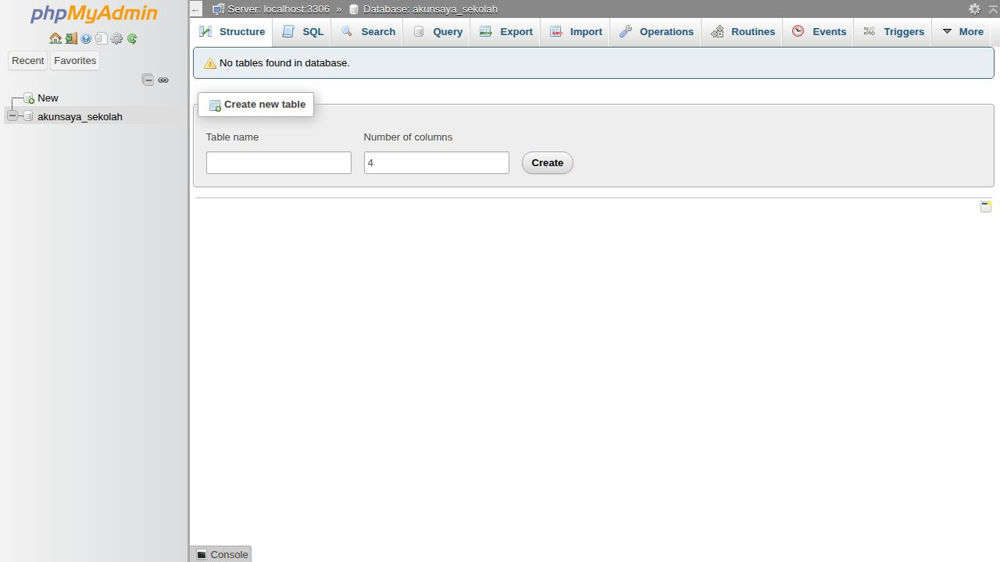

3. Klik tab **Import** → **Choose File** → pilih file `.sql` yang diinginkan
   (pada contoh: `sekolah_mysql_kosong.sql`).

   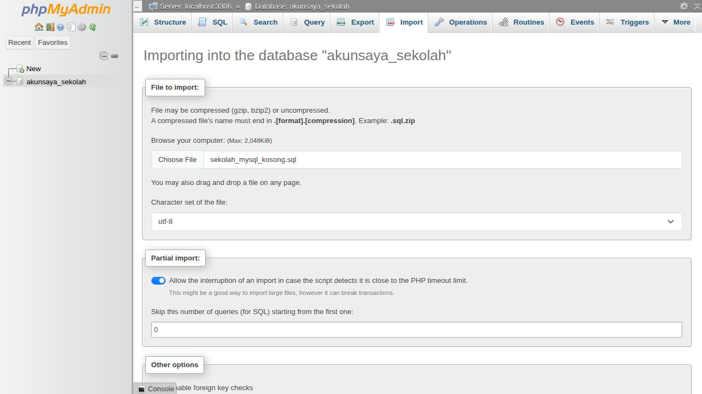

4. Biarkan pengaturan lain default (Format: SQL, Character set: utf-8), gulir ke bawah, lalu klik **Import** / **Go**.
5. Pastikan muncul pesan hijau *"Import has been successfully finished"*, dan di panel kiri terlihat **14 tabel**:
   `announcements, attendance, classes, grades, invoices, letters, payments, report_notes, schedules,
   settings, students, subjects, teaching_assignments, users`.

   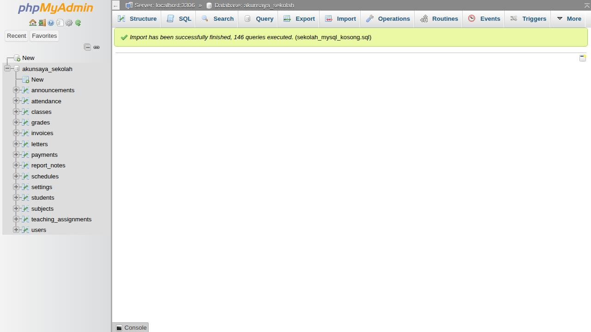

6. Klik nama database untuk melihat daftar tabel beserta jumlah barisnya.

   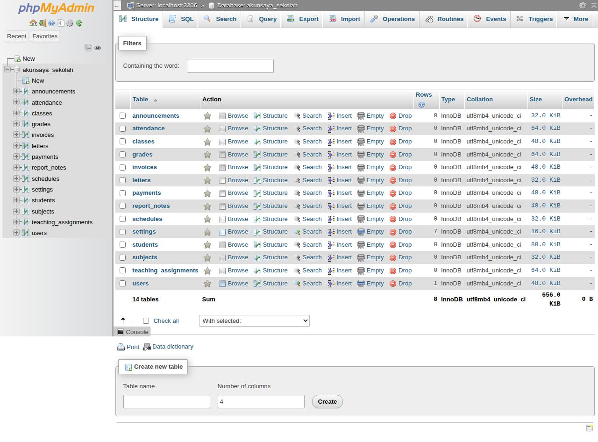

> Ingin memulai ulang? Di phpMyAdmin pilih semua tabel → **Drop**, lalu import lagi.
> File SQL sudah memuat `DROP TABLE IF EXISTS`, jadi import ulang juga akan menimpa tabel lama.

---

## 7. Upload File Aplikasi

Pilih **salah satu** metode berikut.

### Metode A — Subdomain dengan document root `public/` (disarankan)

Metode paling aman karena kode & konfigurasi berada di luar folder web.
Contoh alamat hasil: `https://siakad.namasekolah.sch.id`

<div class="menu-path">cPanel › Files › File Manager</div> lalu <div class="menu-path">cPanel › Domains › Domains › Create A New Domain</div>

1. **File Manager** → buka folder home (`/home/akunsaya/`, satu tingkat **di atas** `public_html`).
2. **Upload** `siakad.zip` → klik kanan → **Extract**. Hasilnya folder `/home/akunsaya/siakad/`.
3. Buka menu **Domains** (atau **Subdomains** pada cPanel lama) → **Create A New Domain**:
   - Domain: `siakad.namasekolah.sch.id`
   - Hilangkan centang *"Share document root"* (jika ada)
   - **Document Root:** `siakad/public`
   - **Submit**.

   ```
   /home/akunsaya/
   ├── public_html/          ← website utama sekolah (tidak diubah)
   └── siakad/
       ├── app/  config.php  config.local.php  database/   ← tidak bisa diakses dari browser
       └── public/           ← Document Root subdomain
   ```

   Pada Metode A, file `config.local.php` di langkah 8 dibuat di `/home/akunsaya/siakad/`.

### Metode B — Langsung di `public_html` (domain utama atau subfolder)

Gunakan metode ini bila document root tidak bisa diubah (misalnya domain utama).
File `.htaccess` bawaan akan otomatis meneruskan semua permintaan ke folder `public/` dan
**memblokir** akses ke `app/`, `database/`, `config.php`, `config.local.php`, serta file `.sql`.

<div class="menu-path">cPanel › Files › File Manager</div>

1. **File Manager** → klik **Settings** (kanan atas) → centang **Show Hidden Files (dotfiles)** → **Save**.
   Ini penting agar file `.htaccess` terlihat.
2. Buka `public_html/` (untuk domain utama) atau buat subfolder, misalnya `public_html/siakad/`.
3. **Upload** `siakad.zip` → **Extract** di folder tersebut.
4. Pastikan isi folder (bukan folder bertingkat) langsung berada di sana: `public_html/.htaccess`,
   `public_html/app/`, `public_html/public/`, dst. Jika hasil ekstrak menjadi
   `public_html/Baru-main/...`, pindahkan (Move) seluruh isinya satu tingkat ke atas atau ganti nama foldernya.

Alamat hasil:

- `https://namasekolah.sch.id` (bila di `public_html/`)
- `https://namasekolah.sch.id/siakad/` (bila di `public_html/siakad/`)

> **Verifikasi keamanan:** setelah langkah 8, buka `https://namasekolah.sch.id/config.php` dan
> `https://namasekolah.sch.id/database/sekolah_mysql.sql`. Keduanya **harus** menampilkan
> *403 Forbidden* seperti gambar berikut. Jika file bisa diunduh, `.htaccess` belum ter-upload — ulangi langkah 1 di atas.

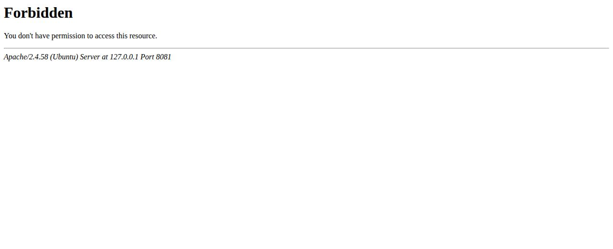

---

## 8. Menghubungkan Aplikasi ke Database

1. Di **File Manager**, buka folder aplikasi (`siakad/` untuk Metode A atau `public_html/` untuk Metode B).
2. Klik kanan `config.local.example.php` → **Copy** → beri nama **`config.local.php`**.
3. Klik kanan `config.local.php` → **Edit**, lalu sesuaikan:

   ```php
   <?php
   return [
       'app_name' => 'SIAKAD Sekolah',
       'debug'    => false,

       'db' => [
           'driver' => 'mysql',
           'host'   => 'localhost',
           'port'   => '3306',
           'name'   => 'akunsaya_sekolah',   // nama database dari langkah 5
           'user'   => 'akunsaya_siakad',    // user database dari langkah 5
           'pass'   => 'PasswordDatabaseAnda',
       ],
   ];
   ```

4. **Save Changes**.
5. (Opsional, disarankan) Klik kanan `config.local.php` → **Change Permissions** → **600**
   (atau **640** bila muncul error izin akses).
6. Buka alamat aplikasi di browser. Halaman login akan tampil. Nama sekolah masih bertuliskan
   *"Nama Sekolah"* sampai diisi di menu **Pengaturan** (langkah 11).

   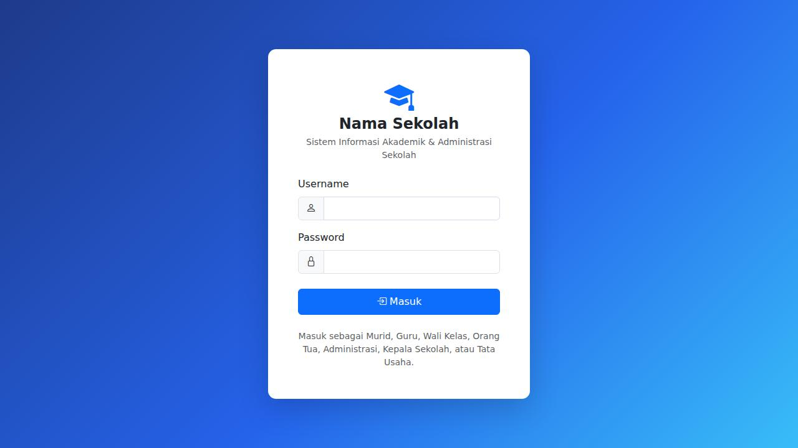

   Jika yang muncul halaman berikut, periksa kembali isi `config.local.php`
   (lihat [Pemecahan Masalah](#14-pemecahan-masalah)):

   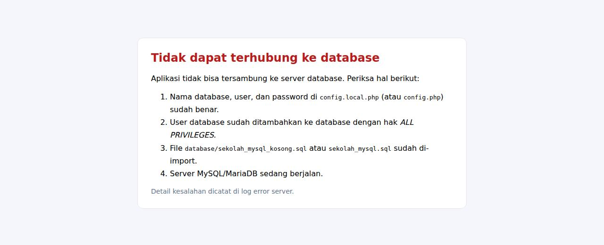

> Gunakan `localhost` sebagai host. Beberapa hosting memakai host database terpisah
> (misalnya `mysql.namahosting.com`) — lihat informasi di halaman **MySQL® Databases** atau
> dokumentasi hosting Anda.

> **Mengapa `config.local.php`?** File ini menimpa pengaturan di `config.php`, sehingga saat memperbarui
> aplikasi Anda cukup menimpa file-file lain tanpa kehilangan pengaturan database.

---

## 9. Mengaktifkan HTTPS (SSL)

<div class="menu-path">cPanel › Security › SSL/TLS Status</div> dan <div class="menu-path">cPanel › Domains › Domains › Force HTTPS Redirect</div>

1. **SSL/TLS Status** → centang domain/subdomain aplikasi → **Run AutoSSL** (gratis, Let's Encrypt/Sectigo).
2. **Domains** → aktifkan **Force HTTPS Redirect** untuk domain tersebut.

Aplikasi otomatis menandai cookie sesi sebagai *Secure* ketika diakses lewat HTTPS.

---

## 10. Login Pertama & Checklist Keamanan

| Database yang di-import | Username | Password awal |
|---|---|---|
| `sekolah_mysql_kosong.sql` | `admin` | `admin12345` |
| `sekolah_mysql.sql` (data contoh) | `admin`, `kepsek`, `tu`, `guru1`, `walikelas1`, `siswa1`, `ortu1`, … | `password123` |

Setelah login, aplikasi akan memberi peringatan bila Anda masih memakai password bawaan:

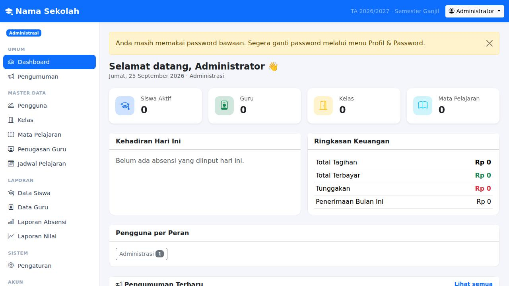

**Mengganti password:** klik nama Anda di kanan atas → **Profil**, atau menu **Profil & Password** di
sidebar. Isi password lama, password baru (minimal 8 karakter), dan konfirmasinya → **Ganti Password**.

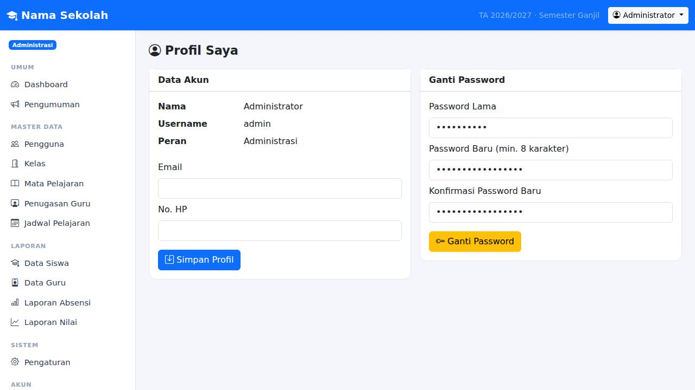

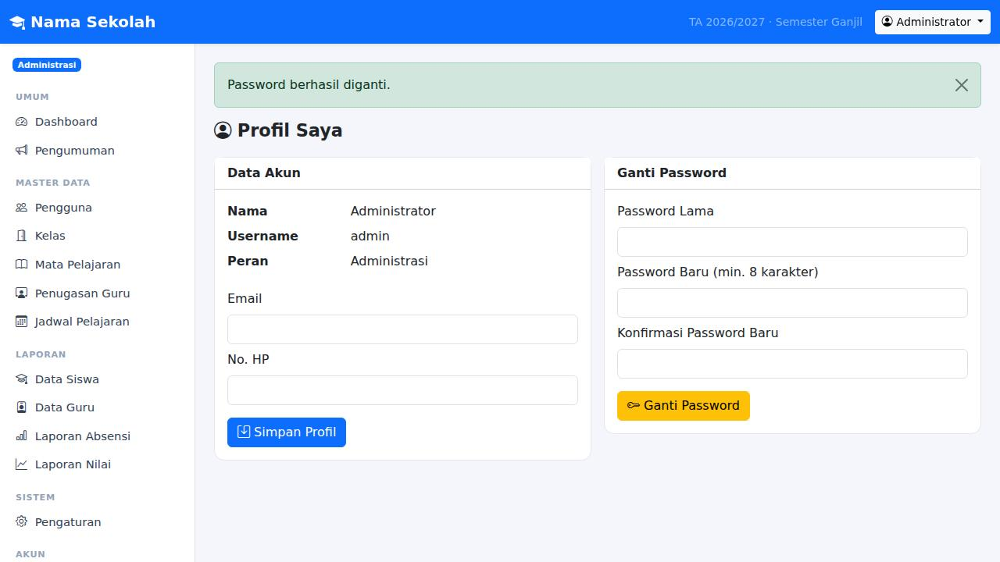

**Checklist sebelum dipakai sungguhan:**

- [ ] Ganti password `admin` di menu **Profil & Password** (minimal 8 karakter).
- [ ] Bila sempat memakai data contoh, **import ulang `sekolah_mysql_kosong.sql`** agar akun demo
      (dengan password yang diketahui umum) terhapus.
- [ ] `debug` bernilai `false` di `config.local.php`.
- [ ] `https://…/config.php` dan `https://…/database/sekolah_mysql.sql` menampilkan **403**
      (hanya untuk Metode B; pada Metode A file tersebut memang berada di luar folder web).
- [ ] HTTPS aktif dan dipaksa.
- [ ] Hapus file ZIP yang sudah diekstrak dari server.

---

## 11. Mengisi Data Awal Sekolah

Login sebagai **admin**, lalu isi data dengan urutan berikut (karena saling bergantung):

1. **Pengaturan** — nama sekolah, alamat, telepon, nama & NIP kepala sekolah, **tahun ajaran** (format
   `2026/2027`) dan **semester** aktif → **Simpan Pengaturan**.

   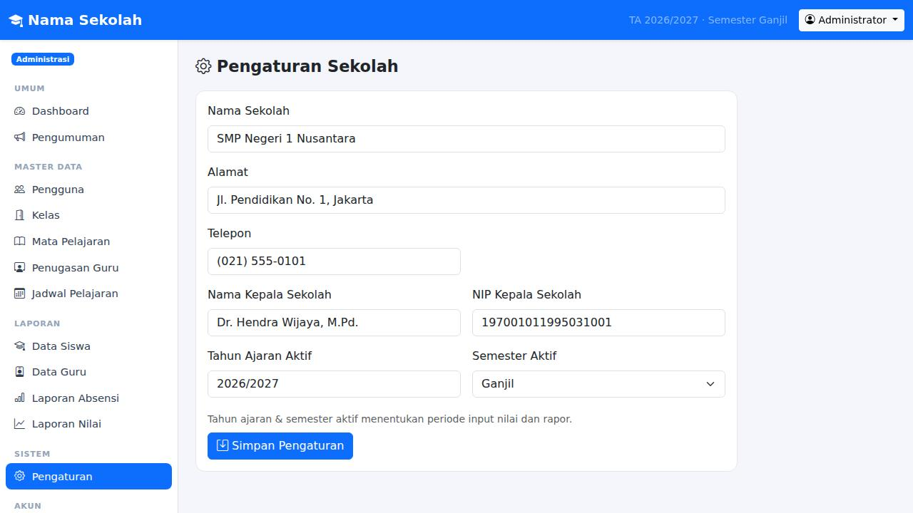

2. **Pengguna → Tambah Pengguna** untuk staf: Kepala Sekolah, Tata Usaha, Guru, dan **Wali Kelas**
   (wali kelas juga bisa mengajar mata pelajaran).

   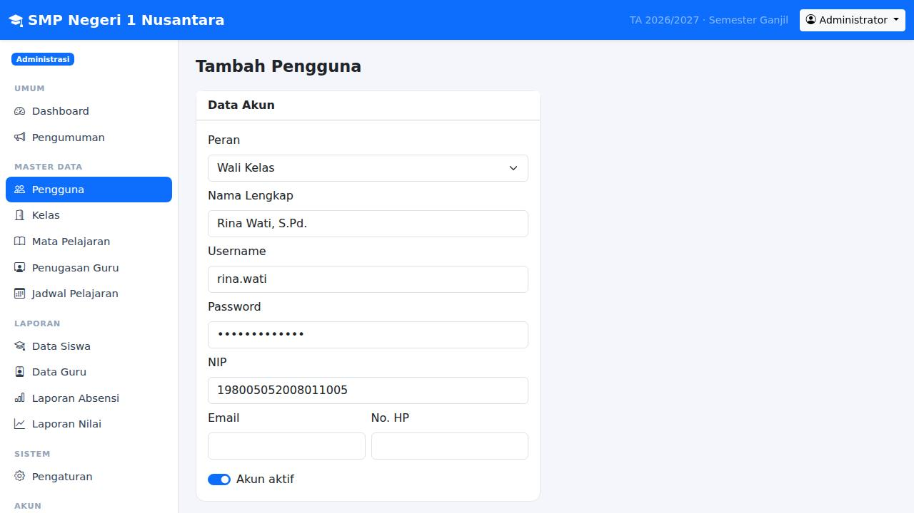

3. **Kelas → Tambah Kelas** — nama (mis. `VII-A`), tingkat (7), dan wali kelasnya.

   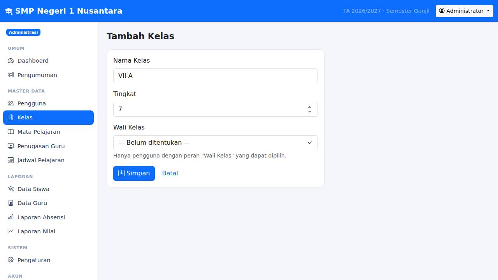

4. **Mata Pelajaran → Tambah Mapel** — kode, nama, dan KKM.

   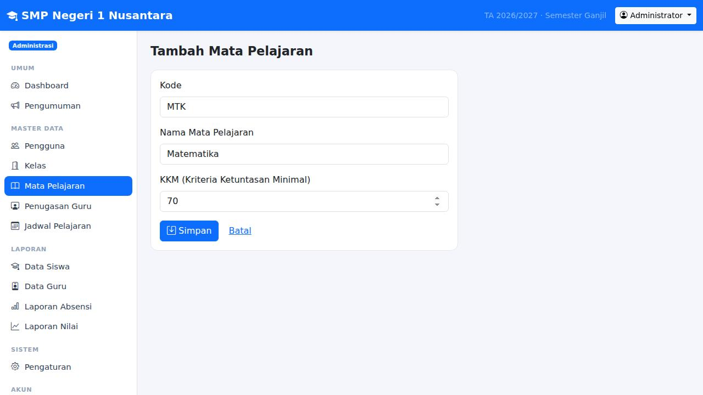

5. **Penugasan Guru** — tentukan guru pengampu setiap mata pelajaran di setiap kelas.

   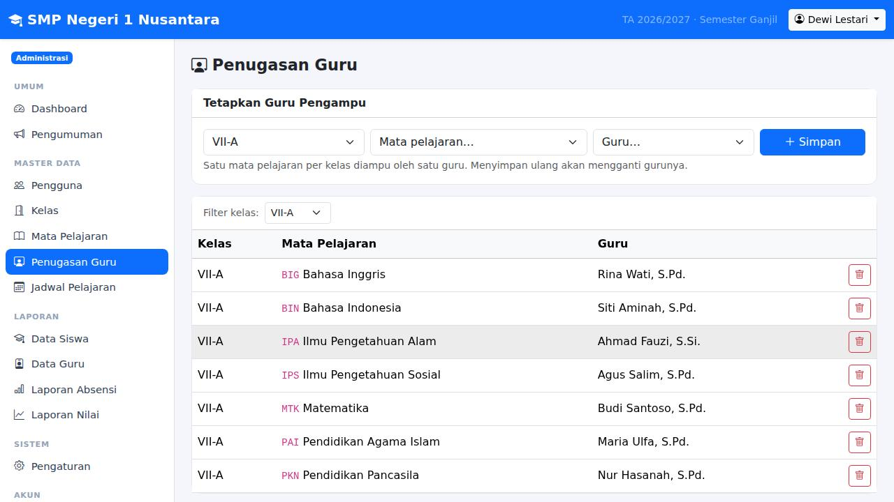

6. **Jadwal Pelajaran** — per kelas; aplikasi menolak jadwal yang bentrok (kelas maupun guru).

   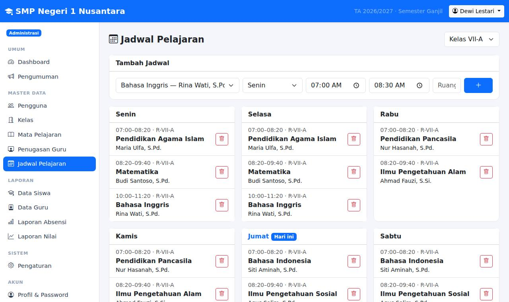

7. **Pengguna → Tambah Pengguna** dengan peran **Orang Tua Murid**.
8. **Pengguna → Tambah Pengguna** dengan peran **Murid** — isi NIS, kelas, dan hubungkan ke akun orang tua.

   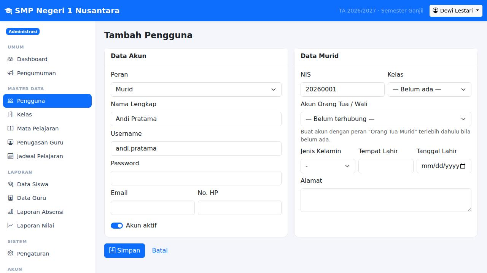

Setelah itu Tata Usaha bisa membuat tagihan, guru mulai mengisi absensi & nilai.
Panduan lengkap per peran ada di [PANDUAN-PENGGUNA.md](PANDUAN-PENGGUNA.md).

---

## 12. Backup Otomatis

### Cara manual

- **phpMyAdmin** → pilih database → **Export** → **Go** (menghasilkan file `.sql`).
- Atau **Backup** / **Backup Wizard** di cPanel → *Download a MySQL Database Backup*.

### Cara otomatis dengan Cron Job

1. **File Manager** → buat folder `/home/akunsaya/backup-siakad/`.
<div class="menu-path">cPanel › Advanced › Cron Jobs</div>

2. **Cron Jobs** → *Add New Cron Job* → **Once Per Day** (mis. pukul 01:00) → isi **Command**:

   ```bash
   mysqldump --no-tablespaces -u akunsaya_siakad -p'PasswordDatabaseAnda' akunsaya_sekolah | gzip > /home/akunsaya/backup-siakad/siakad-$(date +\%F).sql.gz
   ```

   Hapus backup yang lebih lama dari 30 hari dengan cron kedua:

   ```bash
   find /home/akunsaya/backup-siakad -name "*.sql.gz" -mtime +30 -delete
   ```

> Tanda `%` pada perintah cron **wajib** ditulis `\%`. Unduh backup secara berkala ke komputer atau
> penyimpanan lain.

---

## 13. Memperbarui Aplikasi

1. **Backup database** (langkah 12) dan file `config.local.php`.
2. Upload ZIP versi baru → **Extract** di folder yang sama, pilih timpa (*overwrite*) file lama.
   `config.local.php` tidak ada di dalam ZIP, sehingga pengaturan Anda tetap aman.
3. Buka aplikasi dan pastikan semuanya berjalan normal.

> Jangan meng-import ulang file `.sql` saat memperbarui — itu akan **menghapus seluruh data**.

---

## 14. Pemecahan Masalah

| Gejala | Penyebab & Solusi |
|---|---|
| Halaman putih / **Error 500** | Versi PHP < 8.1 → atur di langkah 4. Lihat file `error_log` di folder aplikasi atau menu **Errors** cPanel. Jika muncul *"Option Indexes not allowed here"*, hapus baris `Options -Indexes` di `.htaccess`. |
| **"Tidak dapat terhubung ke database"** | Periksa `name`, `user`, `pass` di `config.local.php` — nama database & user **harus memakai awalan** akun cPanel (`akunsaya_`). Pastikan user sudah ditambahkan ke database dengan *ALL PRIVILEGES* (langkah 5.4). Coba `host` = `localhost`. |
| Tampilan berantakan (tanpa warna/ikon) | `.htaccess` tidak ter-upload atau `mod_rewrite` nonaktif → aktifkan *Show Hidden Files* dan upload ulang. Sementara, akses lewat `…/public/`. |
| `config.php` / file `.sql` bisa dibuka dari browser | `.htaccess` di root aplikasi hilang → upload ulang. Atau gunakan **Metode A**. |
| **"Sesi formulir telah kedaluwarsa"** (419) | Halaman dibuka terlalu lama atau cookie diblokir. Muat ulang halaman lalu kirim lagi. Pastikan jam server benar dan browser menerima cookie. |
| **"Terlalu banyak percobaan gagal"** | Proteksi login: 5 kali gagal → tunggu 60 detik. |
| Import SQL gagal: *#1044 Access denied* | Pastikan Anda memilih database terlebih dahulu di panel kiri phpMyAdmin sebelum klik **Import**. |
| Import SQL gagal: *Unknown collation* | MySQL terlalu lama (< 5.5). Minta hosting memperbarui atau pilih server MariaDB/MySQL terbaru. |
| Lupa password admin | phpMyAdmin → database → tab **SQL**, jalankan perintah di bawah, lalu login dengan `admin12345` dan segera ganti password. |

Reset password admin menjadi `admin12345` — di phpMyAdmin pilih database → tab **SQL** → tempel perintah berikut → **Go**:

```sql
UPDATE users
SET password_hash = '$2y$12$FhzU3RY2x3znCoTJICp/QeSaS3.sIH4l96VJMA5XjvCnt9NZx8SFi', active = 1
WHERE username = 'admin';
```

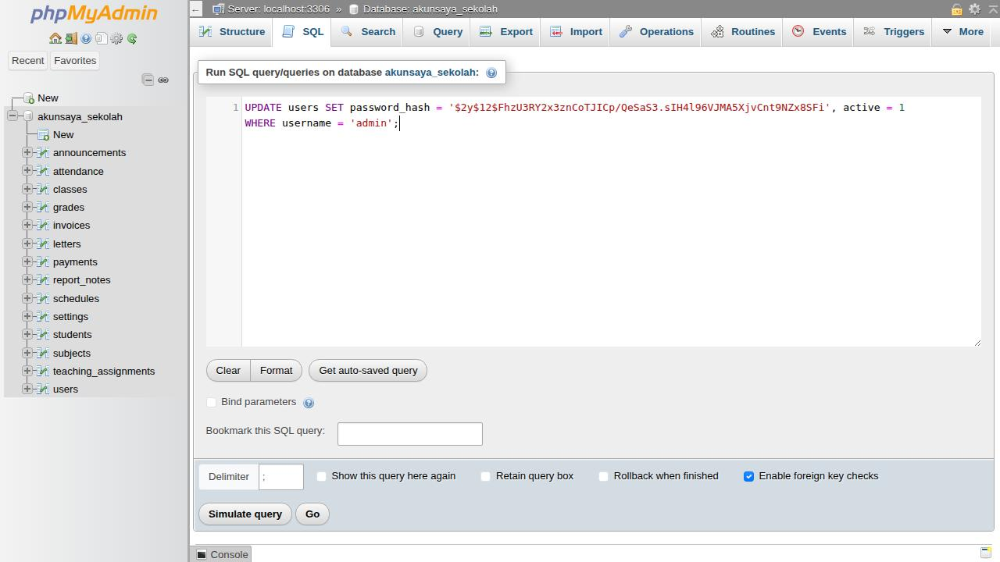

Menampilkan pesan error detail untuk diagnosis (**kembalikan ke `false` setelah selesai**):

```php
// config.local.php
'debug' => true,
```

---

Lihat juga: [Panduan Pengguna](PANDUAN-PENGGUNA.md) · [Dokumentasi Teknis](DOKUMENTASI-TEKNIS.md) · [README](../README.md)
