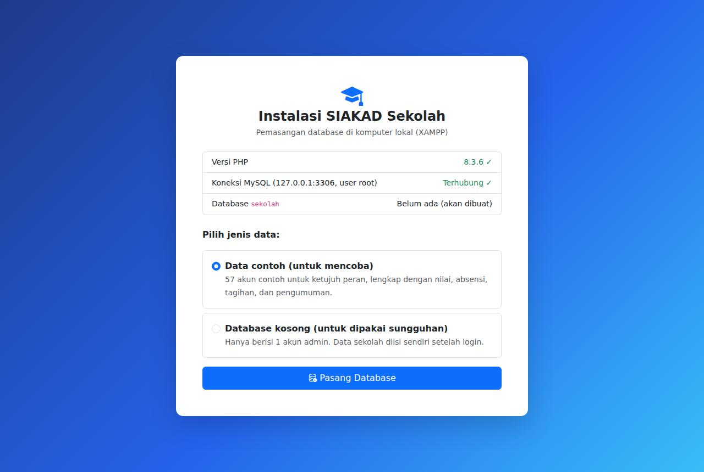
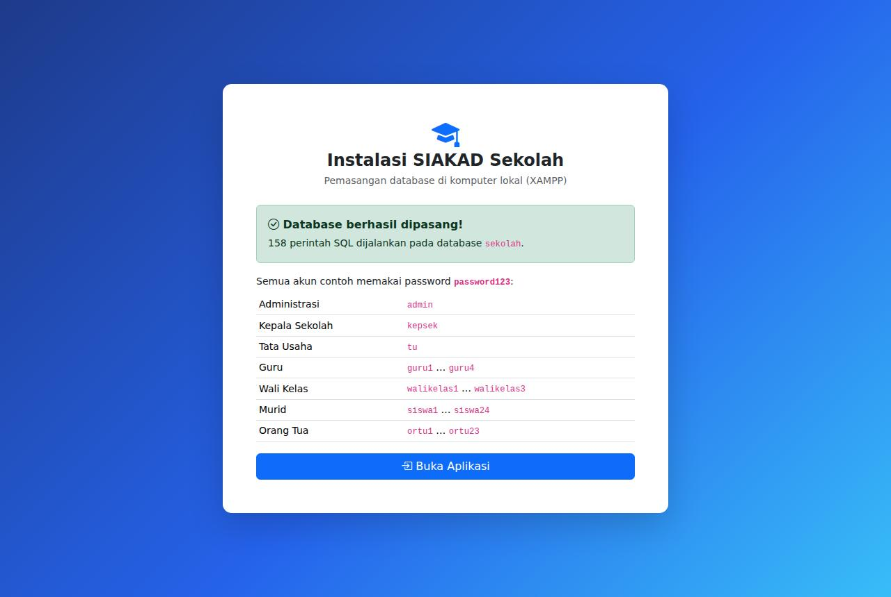
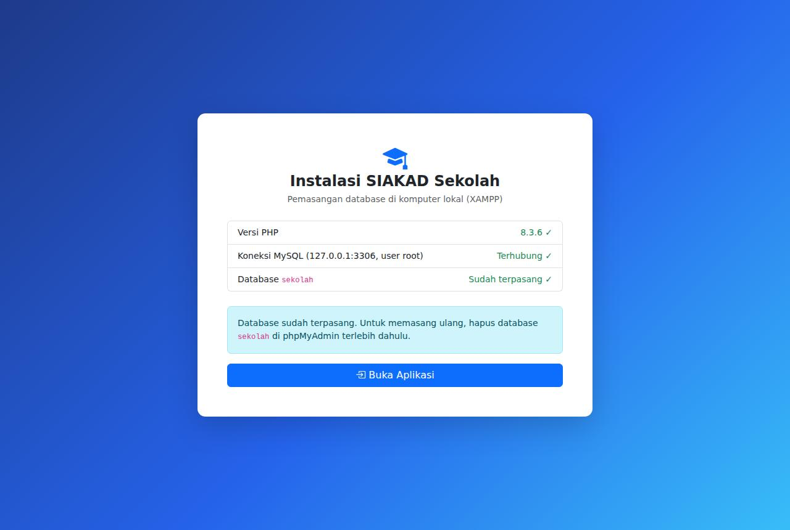
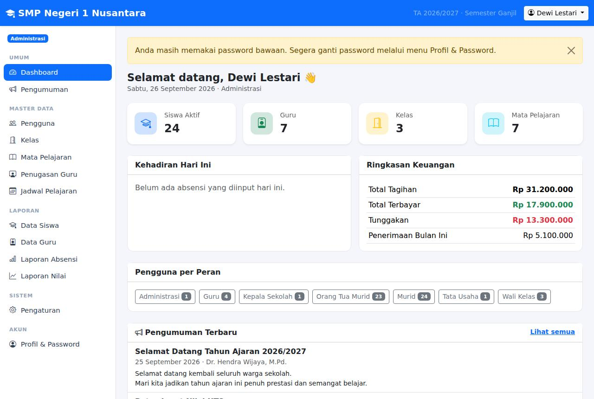
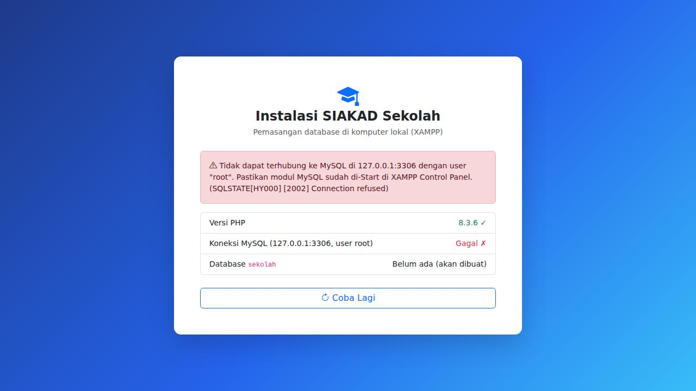

# Panduan Instalasi SIAKAD Sekolah di XAMPP (Localhost, Tanpa Internet)

Panduan ini untuk menjalankan SIAKAD Sekolah di **komputer sendiri** memakai **XAMPP**, misalnya untuk uji coba,
pelatihan, atau server di jaringan lokal sekolah. Setelah XAMPP terpasang, aplikasi berjalan **sepenuhnya tanpa
internet**: semua tampilan (Bootstrap, ikon, font) sudah disertakan di dalam aplikasi.

> Estimasi waktu: 10 menit (belum termasuk mengunduh XAMPP).

## Daftar Isi

1. [Ringkasan Langkah](#1-ringkasan-langkah)
2. [Persyaratan](#2-persyaratan)
3. [Memasang XAMPP](#3-memasang-xampp)
4. [Menyalin Folder Aplikasi](#4-menyalin-folder-aplikasi)
5. [Menjalankan Apache & MySQL](#5-menjalankan-apache--mysql)
6. [Instalasi Database Otomatis](#6-instalasi-database-otomatis)
7. [Login Pertama](#7-login-pertama)
8. [Instalasi Manual lewat phpMyAdmin (Alternatif)](#8-instalasi-manual-lewat-phpmyadmin-alternatif)
9. [Mengakses dari Komputer Lain di Jaringan Sekolah](#9-mengakses-dari-komputer-lain-di-jaringan-sekolah)
10. [Pengaturan Lanjutan](#10-pengaturan-lanjutan)
11. [Backup & Pasang Ulang](#11-backup--pasang-ulang)
12. [Pemecahan Masalah](#12-pemecahan-masalah)

---

## 1. Ringkasan Langkah

| # | Langkah | Keterangan |
|---|---|---|
| 1 | Pasang **XAMPP 8.2** atau lebih baru | Unduh sekali dari apachefriends.org |
| 2 | Ekstrak `siakad.zip` ke folder **`htdocs`** | Windows: `C:\xampp\htdocs\siakad` |
| 3 | Buka **XAMPP Control Panel**, klik **Start** pada **Apache** dan **MySQL** | Keduanya harus berwarna hijau |
| 4 | Buka **http://localhost/siakad** di browser | Otomatis diarahkan ke halaman instalasi |
| 5 | Pilih jenis data → **Pasang Database** | Database `sekolah` dibuat otomatis |
| 6 | Login | Data contoh: `admin` / `password123` · Database kosong: `admin` / `admin12345` |

---

## 2. Persyaratan

| Komponen | Kebutuhan |
|---|---|
| Sistem operasi | Windows 10/11, macOS, atau Linux |
| XAMPP | Versi **8.2.x** atau lebih baru (berisi PHP ≥ 8.1, MariaDB, Apache, phpMyAdmin) |
| Browser | Chrome, Edge, Firefox, atau Safari versi terbaru |
| Ruang disk | ± 20 MB untuk aplikasi & dokumentasi (XAMPP sendiri ± 800 MB) |
| Internet | Hanya untuk mengunduh XAMPP. Aplikasi **tidak memerlukan internet** |

> **XAMPP 8.0 tidak didukung** karena berisi PHP 8.0. Bila versi PHP terlalu lama, aplikasi akan menampilkan
> pesan *"Versi PHP terlalu lama"*. Pasang XAMPP versi terbaru.

---

## 3. Memasang XAMPP

1. Unduh XAMPP dari **https://www.apachefriends.org** (pilih versi PHP 8.2 atau lebih baru).
2. Jalankan installer. Komponen yang dibutuhkan: **Apache**, **MySQL**, **PHP**, dan **phpMyAdmin**
   (sudah tercentang secara default).
3. Gunakan folder instalasi default:

   | Sistem | Folder XAMPP | Folder `htdocs` |
   |---|---|---|
   | Windows | `C:\xampp` | `C:\xampp\htdocs` |
   | macOS | `/Applications/XAMPP` | `/Applications/XAMPP/xamppfiles/htdocs` |
   | Linux | `/opt/lampp` | `/opt/lampp/htdocs` |

> Pada Windows, bila muncul peringatan *User Account Control*, pilih **OK** — itu sebabnya disarankan memasang
> di `C:\xampp`, bukan di `C:\Program Files`.

---

## 4. Menyalin Folder Aplikasi

1. Klik kanan **`siakad.zip`** → **Extract All…** (Windows) atau klik dua kali (macOS).
2. Hasilnya folder **`siakad`** berisi `app`, `database`, `docs`, `public`, `.htaccess`, `index.php`, dan lainnya.
3. Salin folder **`siakad`** ke dalam folder **`htdocs`**, sehingga menjadi:

   ```
   C:\xampp\htdocs\siakad\
   ├── .htaccess          ← jangan dihapus (file tersembunyi)
   ├── app\
   ├── database\
   ├── docs\              ← dokumentasi PDF ada di docs\pdf\
   ├── public\
   ├── config.php
   └── index.php
   ```

> **Penting:** pastikan tidak terjadi folder bertingkat seperti `htdocs\siakad\siakad\app`. Bila terjadi,
> pindahkan isi folder bagian dalam satu tingkat ke atas.

Nama folder boleh diganti (misalnya `sekolah`); alamatnya ikut berubah menjadi `http://localhost/sekolah`.

---

## 5. Menjalankan Apache & MySQL

1. Buka **XAMPP Control Panel**
   (Windows: menu Start → *XAMPP Control Panel*; macOS: *manager-osx*; Linux: `sudo /opt/lampp/manager-linux-x64.run`).
2. Klik **Start** pada baris **Apache**, lalu **Start** pada baris **MySQL**.
3. Tunggu hingga nama modul **Apache** dan **MySQL** berlatar **hijau** dan kolom *Port(s)* menampilkan
   `80, 443` dan `3306`.

> Bila Apache gagal start karena port 80 dipakai program lain (Skype, IIS, VMware), lihat
> [Pemecahan Masalah](#12-pemecahan-masalah).

---

## 6. Instalasi Database Otomatis

1. Buka browser, ketik alamat **http://localhost/siakad**.
2. Karena database belum ada, aplikasi otomatis membuka **halaman instalasi**
   (`http://localhost/siakad/setup.php`). Pastikan ketiga pemeriksaan bertanda ✓ atau *"Belum ada (akan dibuat)"*.

   

3. Pilih jenis data:

   | Pilihan | Isi | Cocok untuk |
   |---|---|---|
   | **Data contoh** | 57 akun (semua peran), nilai, absensi, tagihan, pengumuman, arsip surat | Mencoba aplikasi, demo, pelatihan |
   | **Database kosong** | 1 akun `admin` | Dipakai sungguhan di sekolah |

4. Klik **Pasang Database**. Dalam beberapa detik akan muncul pesan berhasil beserta daftar akun.

   

5. Klik **Buka Aplikasi**.

Halaman instalasi hanya bisa dibuka dari komputer tempat XAMPP berjalan, dan otomatis menolak bekerja bila
database sudah terpasang — data Anda tidak akan tertimpa.



---

## 7. Login Pertama

| Database | Username | Password |
|---|---|---|
| Data contoh | `admin` (Administrasi), `kepsek`, `tu`, `guru1`–`guru4`, `walikelas1`–`walikelas3`, `siswa1`–`siswa24`, `ortu1`–`ortu23` | `password123` |
| Database kosong | `admin` | `admin12345` |



Setelah login dengan database kosong:

1. Ganti password di menu **Profil & Password**.
2. Buka **Pengaturan** untuk mengisi nama sekolah, tahun ajaran, dan semester.
3. Isi data kelas, mata pelajaran, guru, orang tua, dan murid — urutannya dijelaskan di
   **Panduan Pengguna** bagian Administrasi.

---

## 8. Instalasi Manual lewat phpMyAdmin (Alternatif)

Gunakan cara ini bila halaman instalasi otomatis tidak dapat dipakai.

1. Buka **http://localhost/phpmyadmin**.
2. Klik **New** di panel kiri → isi nama database **`sekolah`** → collation **`utf8mb4_unicode_ci`** → **Create**.
3. Pilih database `sekolah` → tab **Import** → **Choose File** → pilih salah satu:
   - `htdocs\siakad\database\sekolah_mysql.sql` (data contoh), atau
   - `htdocs\siakad\database\sekolah_mysql_kosong.sql` (database kosong).
4. Klik **Import** / **Go** dan pastikan muncul pesan *"Import has been successfully finished"*.
5. Buka **http://localhost/siakad**.

Tampilan phpMyAdmin untuk langkah-langkah ini sama dengan yang ditunjukkan di **Panduan Instalasi cPanel**
bagian *Import Database lewat phpMyAdmin*.

---

## 9. Mengakses dari Komputer Lain di Jaringan Sekolah

Komputer XAMPP dapat menjadi server untuk komputer/HP lain di jaringan lokal (Wi-Fi/LAN sekolah) — tetap tanpa internet.

1. Cari alamat IP komputer XAMPP. Windows: buka *Command Prompt* → ketik `ipconfig` → lihat
   **IPv4 Address**, misalnya `192.168.1.10`.
2. Izinkan Apache di firewall: saat pertama kali Apache di-start, Windows biasanya menanyakan izin — pilih
   **Allow access** untuk jaringan *Private*. Bila terlewat: *Windows Defender Firewall* →
   *Allow an app through firewall* → centang **Apache HTTP Server**.
3. Dari komputer/HP lain, buka **http://192.168.1.10/siakad**.

> Halaman instalasi (`setup.php`) tetap hanya bisa dibuka dari komputer XAMPP itu sendiri.
> Gunakan alamat IP tetap (*static IP*) atau reservasi DHCP di router agar alamat server tidak berubah.

---

## 10. Pengaturan Lanjutan

Secara default aplikasi terhubung ke MySQL XAMPP dengan user **`root`** tanpa password di `127.0.0.1:3306`
dan database **`sekolah`** — tidak perlu mengubah apa pun. Bila pengaturan MySQL Anda berbeda (misalnya root
diberi password atau port diganti), salin `config.local.example.php` menjadi **`config.local.php`** lalu sesuaikan:

```php
<?php
return [
    'db' => [
        'driver' => 'mysql',
        'host'   => '127.0.0.1',
        'port'   => '3306',
        'name'   => 'sekolah',
        'user'   => 'root',
        'pass'   => 'password_mysql_anda',
    ],
];
```

> **Keamanan jaringan:** bila komputer dipakai sebagai server di jaringan sekolah, beri password pada user
> `root` MySQL (phpMyAdmin → *User accounts*) dan simpan password tersebut di `config.local.php`.

---

## 11. Backup & Pasang Ulang

- **Backup:** http://localhost/phpmyadmin → pilih database `sekolah` → **Export** → **Go**. Simpan file `.sql`
  di flashdisk atau penyimpanan lain secara berkala.
- **Mengembalikan backup:** buat database `sekolah` kosong → **Import** file backup.
- **Pasang ulang dari awal** (misalnya beralih dari data contoh ke database kosong):
  phpMyAdmin → pilih database `sekolah` → **Operations** → **Drop the database (DROP)** → buka lagi
  **http://localhost/siakad/setup.php**.

---

## 12. Pemecahan Masalah

| Gejala | Penyebab & Solusi |
|---|---|
| *"Tidak dapat terhubung ke MySQL…"* di halaman instalasi | Modul **MySQL** belum di-Start. Buka XAMPP Control Panel → **Start** MySQL → klik **Coba Lagi**. |
| Halaman *"Tidak dapat terhubung ke database"* | Sama seperti di atas, atau password MySQL berbeda → atur `config.local.php` (bagian 10). Tombol **Buka halaman instalasi** tersedia di halaman tersebut. |
| Apache tidak mau start (port 80 dipakai) | Tutup Skype/IIS/VMware, **atau** ganti port: XAMPP Control Panel → Apache **Config** → `httpd.conf` → ubah `Listen 80` menjadi `Listen 8080` → Start. Buka **http://localhost:8080/siakad**. |
| MySQL tidak mau start (port 3306 dipakai) | Hentikan layanan MySQL lain di komputer, atau ubah port di `my.ini` lalu sesuaikan `port` di `config.local.php`. |
| *"Versi PHP terlalu lama"* | XAMPP berisi PHP < 8.1. Pasang XAMPP 8.2 atau lebih baru. |
| Tampilan berantakan / *Not Found* | File `.htaccess` tidak ikut tersalin. Salin ulang seluruh isi ZIP. Sementara, buka **http://localhost/siakad/public/**. |
| *"Sesi formulir telah kedaluwarsa"* | Muat ulang halaman, lalu kirim kembali formulir. |
| Lupa password admin | phpMyAdmin → database `sekolah` → tab **SQL**, jalankan perintah reset di **Panduan Instalasi cPanel** bagian Pemecahan Masalah, lalu login dengan `admin12345`. |
| Halaman instalasi menolak (*403*) | Halaman instalasi hanya dari komputer XAMPP itu sendiri. Buka lewat `http://localhost/siakad/setup.php`, bukan alamat IP. |

Tampilan halaman instalasi bila modul MySQL belum di-Start:



---

Lihat juga: [Panduan Pengguna](PANDUAN-PENGGUNA.md) · [Instalasi di cPanel](INSTALASI-CPANEL.md) · [Dokumentasi Teknis](DOKUMENTASI-TEKNIS.md) · [README](../README.md)
