# Panduan Pengguna SIAKAD Sekolah

Panduan penggunaan aplikasi untuk ketujuh peran: **Administrasi, Kepala Sekolah, Tata Usaha, Guru,
Wali Kelas, Murid, dan Orang Tua Murid**.

> Tangkapan layar diambil dari data contoh (`database/sekolah_mysql.sql`).

## Daftar Isi

- [Dasar Penggunaan](#dasar-penggunaan)
- [Administrasi](#administrasi)
- [Kepala Sekolah](#kepala-sekolah)
- [Tata Usaha](#tata-usaha)
- [Guru](#guru)
- [Wali Kelas](#wali-kelas)
- [Murid](#murid)
- [Orang Tua Murid](#orang-tua-murid)
- [Aturan Penilaian](#aturan-penilaian)
- [Pertanyaan Umum](#pertanyaan-umum)

---

## Dasar Penggunaan

### Masuk (login)

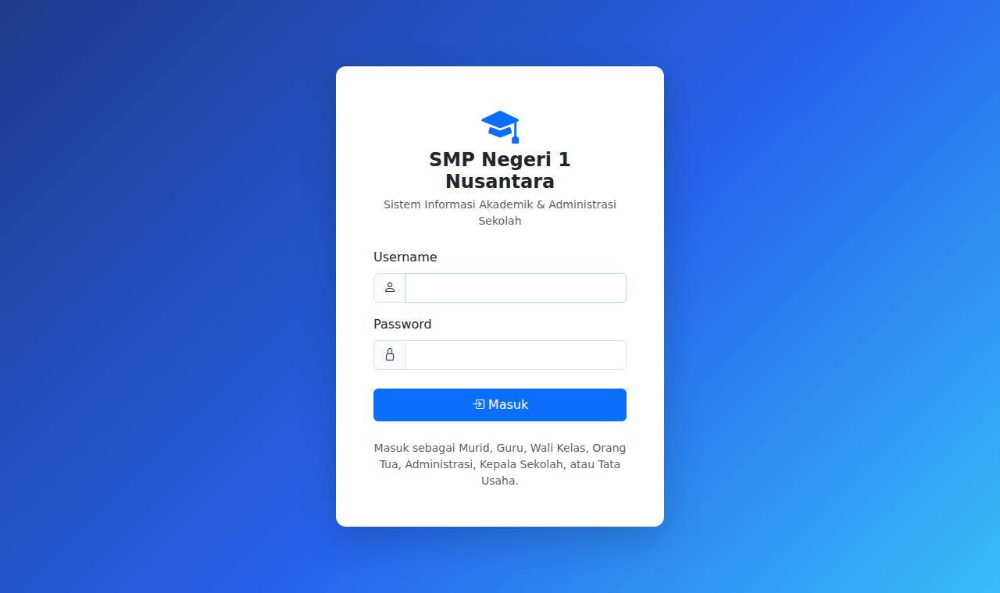

1. Buka alamat aplikasi, masukkan **username** dan **password** yang diberikan bagian administrasi.
2. Setelah 5 kali salah password, login dikunci selama 60 detik.
3. Jika muncul peringatan *"Anda masih memakai password bawaan"*, segera ganti password.

### Tampilan umum

- **Sidebar kiri** berisi menu sesuai peran Anda. Di HP, buka menu dengan tombol ☰ di kiri atas.

  
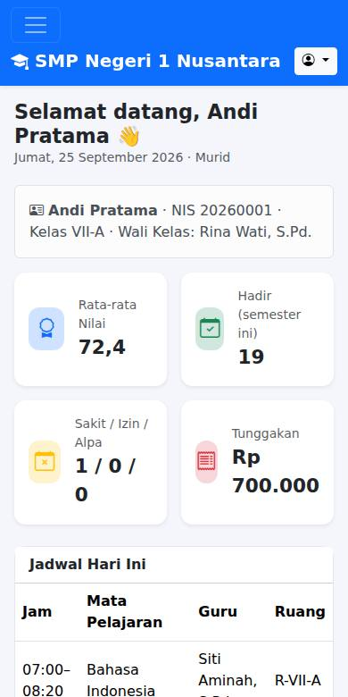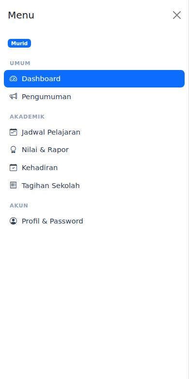

- **Bilah atas** menampilkan nama sekolah, tahun ajaran & semester aktif, serta menu akun
  (Profil, Keluar).
- **Dashboard** menampilkan ringkasan sesuai peran dan pengumuman terbaru.

### Profil & ganti password

Menu **Profil & Password**:

- Ubah email dan nomor HP.
- Ganti password: isi password lama, password baru (minimal 8 karakter), dan konfirmasinya.

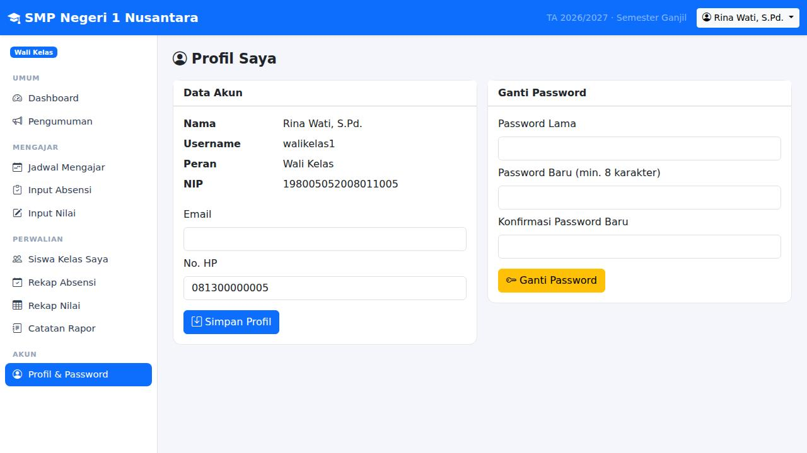

### Pengumuman

Semua pengguna dapat membaca pengumuman di menu **Pengumuman**. Setiap pengumuman memiliki sasaran
(semua pengguna, semua guru, murid, orang tua, dan sebagainya). Pengguna hanya melihat pengumuman yang
ditujukan kepadanya.

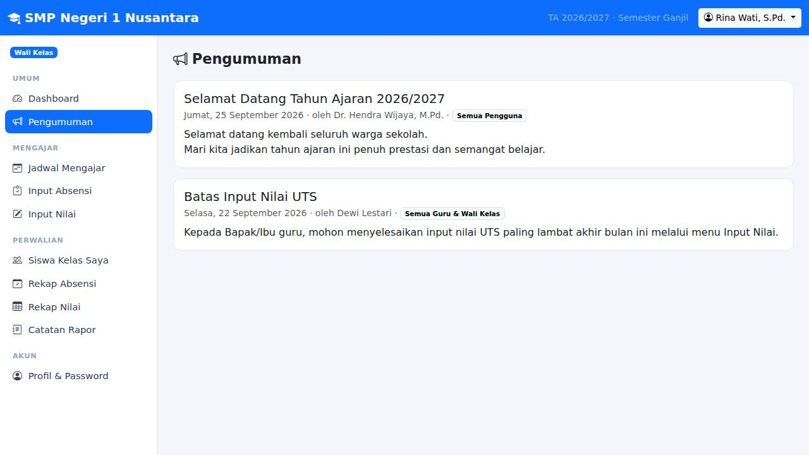

Administrasi, Kepala Sekolah, dan Tata Usaha dapat membuat pengumuman melalui **Buat Pengumuman**:
isi judul, pilih sasaran pada **Ditujukan kepada**, tulis isinya, lalu **Simpan**.

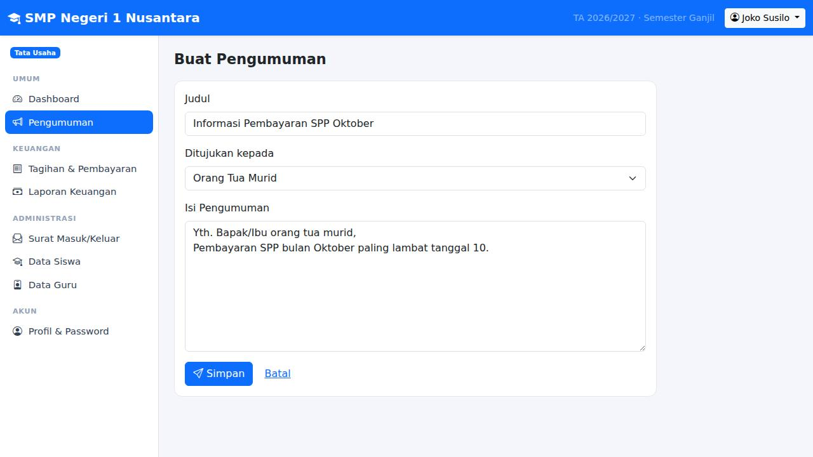

### Mencetak

Halaman rapor, kwitansi, rekap absensi, rekap nilai, dan laporan memiliki tombol **Cetak** 🖨.
Tampilan cetak otomatis menyembunyikan menu dan tombol. Gunakan *Save as PDF* di dialog cetak
browser untuk menyimpan sebagai PDF.

---

## Administrasi

Administrasi mengelola seluruh data induk sekolah.

### Pengguna

Menu **Pengguna** menampilkan semua akun dengan filter peran dan pencarian (nama, username, NIS, NIP).

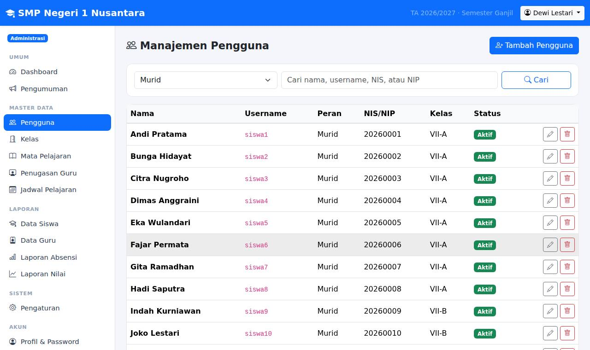

**Menambah pengguna:** klik **Tambah Pengguna** → pilih **Peran** → isi nama, username
(huruf kecil/angka/titik/garis bawah/strip), password (min. 8 karakter), NIP (untuk staf), email, dan HP.

Bila perannya **Murid**, muncul kolom tambahan:

| Kolom | Keterangan |
|---|---|
| NIS | Wajib dan unik |
| Kelas | Kelas tempat murid belajar |
| Akun Orang Tua / Wali | Buat akun orang tua terlebih dahulu. Satu orang tua dapat terhubung ke beberapa anak |
| Jenis kelamin, tempat & tanggal lahir, alamat | Data biodata |

**Aturan penting:**

- Akun yang dinonaktifkan (**Akun aktif** tidak dicentang) tidak bisa login, tetapi datanya tetap tersimpan.
  Untuk murid yang lulus/pindah, **nonaktifkan** daripada menghapus.
- Peran murid tidak dapat diubah ke peran lain.
- Guru yang masih memiliki penugasan mengajar tidak dapat dihapus.
- Anda tidak dapat menghapus, menonaktifkan, atau mengubah peran akun sendiri.
- Menghapus murid juga menghapus nilai, absensi, dan tagihannya.

### Kelas

Menu **Kelas** → **Tambah Kelas**: isi nama (mis. `VII-A`), tingkat (1–12), dan **wali kelas**.
Hanya pengguna berperan *Wali Kelas* yang bisa dipilih, dan satu wali kelas hanya untuk satu kelas.
Kelas yang masih memiliki murid tidak bisa dihapus.

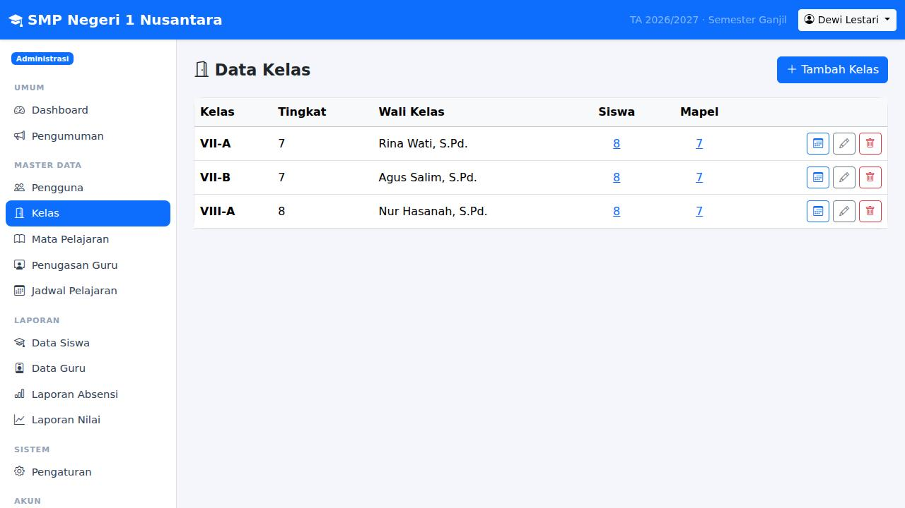

Kolom **Siswa** dan **Mapel** dapat diklik untuk membuka data siswa dan penugasan kelas tersebut;
ikon 📅 membuka jadwal kelas.

### Mata Pelajaran

Isi **kode** (mis. `MTK`), **nama**, dan **KKM** (0–100). KKM dipakai untuk menentukan status
*Tuntas / Belum Tuntas* di rapor.

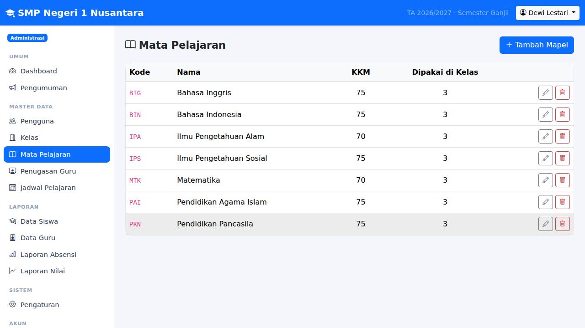

### Penugasan Guru

Tentukan guru pengampu untuk setiap pasangan **kelas + mata pelajaran**. Satu mata pelajaran di satu kelas
hanya diampu satu guru; menyimpan ulang akan mengganti gurunya.

> Menghapus penugasan juga menghapus jadwal dan **nilai** mata pelajaran tersebut di kelas itu.

### Jadwal Pelajaran

Pilih kelas → pilih mata pelajaran/guru, hari, jam mulai, jam selesai, dan ruang → **+**.
Aplikasi menolak jadwal yang **bentrok**, yaitu bila kelas sudah ada pelajaran lain pada jam tersebut atau
gurunya sedang mengajar di kelas lain.

### Pengaturan

Isi identitas sekolah (tampil di rapor & kwitansi), nama dan NIP kepala sekolah (untuk tanda tangan rapor),
serta **tahun ajaran** dan **semester aktif**.

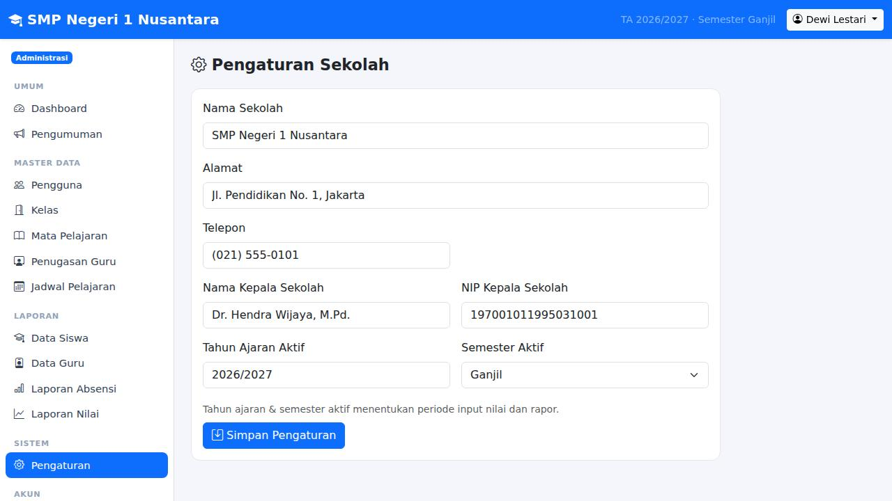

> Tahun ajaran & semester aktif menentukan periode input nilai, catatan rapor, dan rekap kehadiran.
> Ganti di awal semester baru; nilai semester sebelumnya tetap tersimpan dan bisa dilihat di rapor.

### Laporan

Administrasi juga dapat membuka **Data Siswa**, **Data Guru**, **Laporan Absensi**, dan **Laporan Nilai**
(lihat bagian [Kepala Sekolah](#kepala-sekolah)), serta membuat pengumuman.

---

## Kepala Sekolah

Kepala Sekolah memantau seluruh kegiatan sekolah (hanya-baca, kecuali pengumuman).

| Menu | Isi |
|---|---|
| **Dashboard** | Jumlah siswa aktif, guru, kelas, mapel; kehadiran hari ini; ringkasan keuangan |
| **Data Siswa** | Daftar siswa per kelas dengan biodata & orang tua; tombol 🏅 membuka rapor siswa |
| **Data Guru** | Daftar guru, NIP, kelas perwalian, dan mata pelajaran yang diampu |
| **Laporan Absensi** | Rekap H/S/I/A per kelas dan persentase kehadiran pada rentang tanggal tertentu, plus 10 siswa dengan alpa terbanyak |
| **Laporan Nilai** | Rata-rata nilai akhir per kelas & mapel pada semester aktif, serta jumlah siswa di bawah KKM |
| **Laporan Keuangan** | Total tagihan, terbayar, tunggakan per kelas; penerimaan per metode & rinciannya |
| **Arsip Surat** | Daftar surat masuk & keluar yang dicatat Tata Usaha |
| **Pengumuman** | Membuat, mengubah, dan menghapus pengumuman |

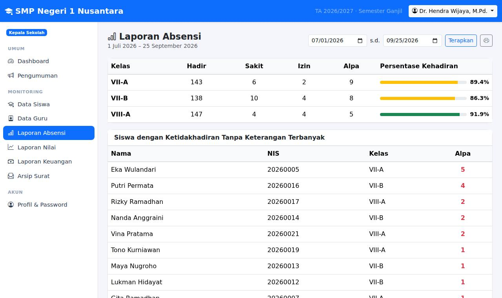

Gunakan filter tanggal (default: semester aktif) lalu **Terapkan**. Tombol 🖨 untuk mencetak.

**Data Siswa** — filter per kelas atau cari nama/NIS; ikon 🏅 membuka rapor siswa.

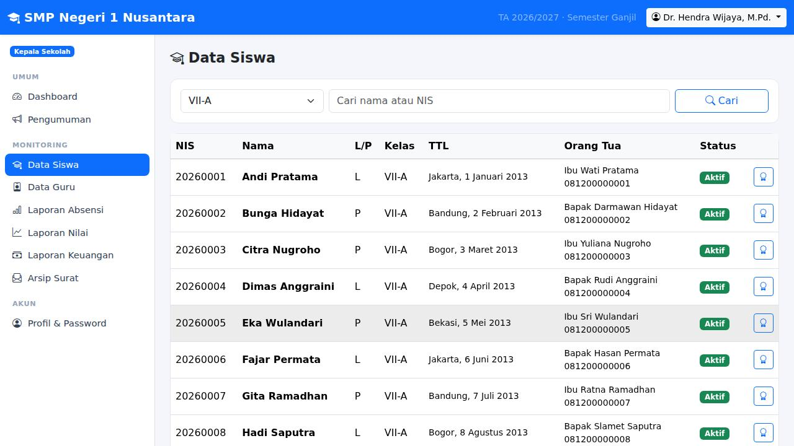

**Data Guru**

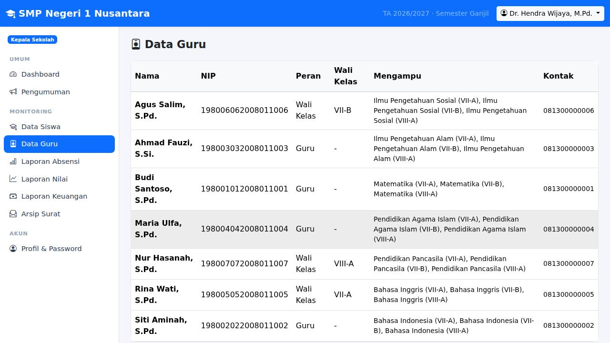

**Laporan Nilai** — angka merah menunjukkan jumlah siswa di bawah KKM.

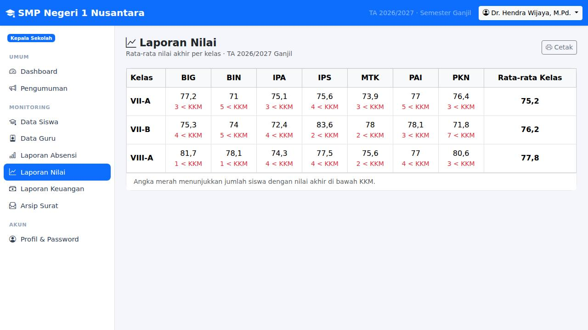

**Laporan Keuangan**

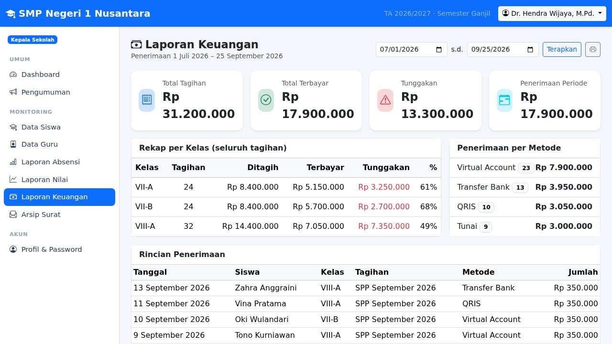

---

## Tata Usaha

### Tagihan & Pembayaran

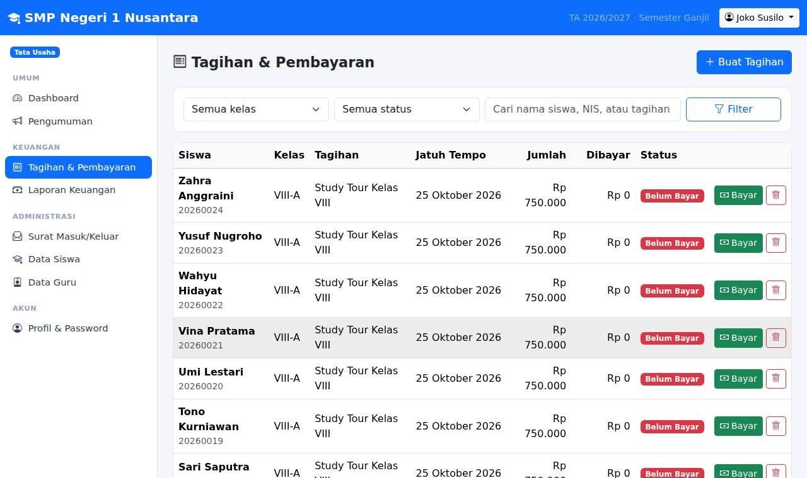

Daftar semua tagihan dengan filter kelas, status (belum lunas / sebagian / lunas), dan pencarian.

**Membuat tagihan** → **Buat Tagihan**:

1. Pilih sasaran: **Satu Siswa**, **Satu Kelas**, atau **Semua Siswa Aktif**.
2. Isi nama tagihan (mis. *SPP Oktober 2026*), jumlah dalam rupiah (boleh ditulis `350000` atau `350.000`),
   dan tanggal jatuh tempo.
3. **Buat Tagihan** — satu tagihan dibuat untuk setiap siswa sasaran.

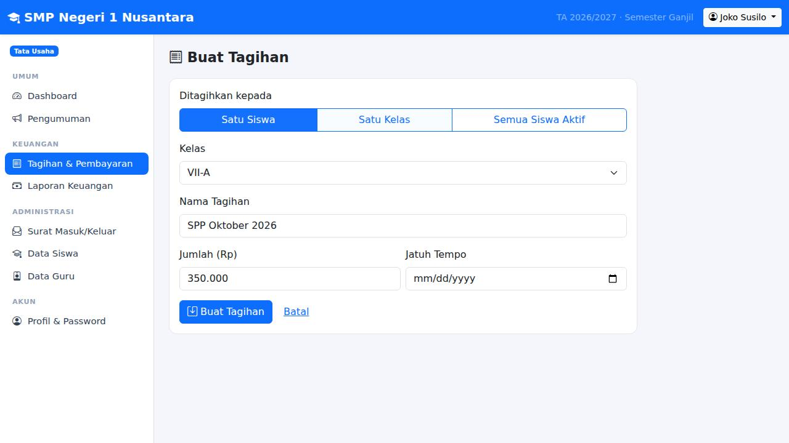

**Mencatat pembayaran** → klik **Bayar** pada tagihan:

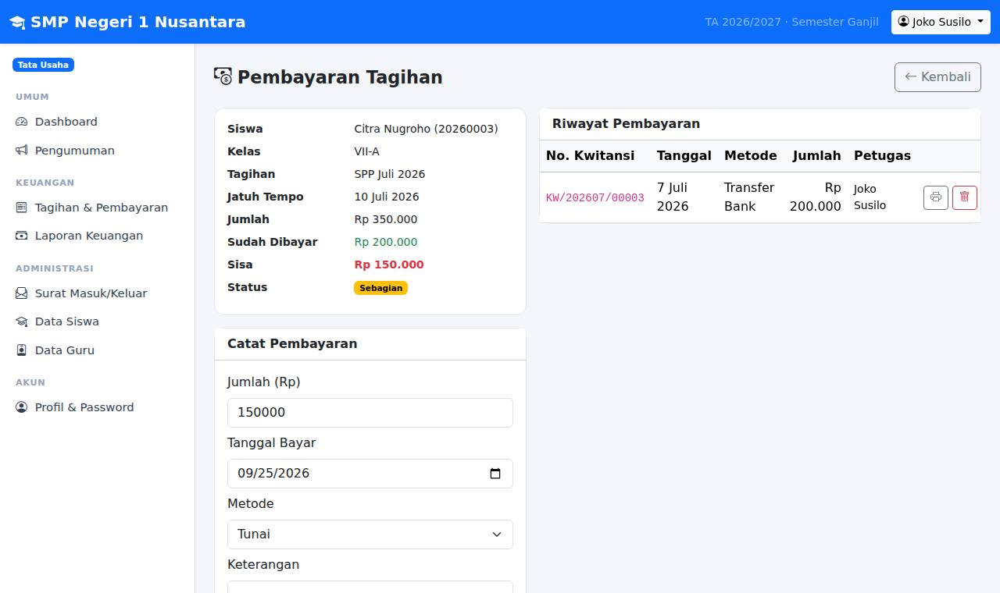

1. Isi jumlah (default: sisa tagihan), tanggal bayar, metode (Tunai / Transfer Bank / QRIS / Virtual Account),
   dan keterangan.
2. **Simpan Pembayaran**. Pembayaran boleh dicicil, tetapi tidak boleh melebihi sisa tagihan.
3. Nomor kwitansi dibuat otomatis dengan format `KW/TahunBulan/Nomor`, misalnya `KW/202609/00012`.
4. Klik 🖨 untuk mencetak **kwitansi**.

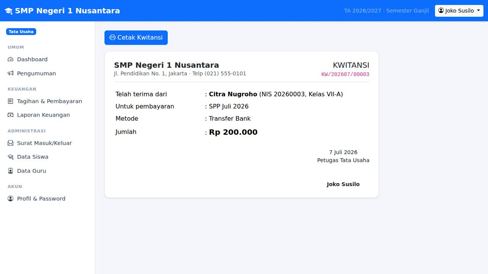

Pembayaran yang salah bisa dibatalkan dengan tombol 🗑. Tagihan hanya bisa dihapus bila belum ada pembayaran.

### Surat Masuk/Keluar

**Catat Surat**: jenis (masuk/keluar), nomor, tanggal, pengirim/penerima, perihal, dan keterangan/disposisi.
Arsip bisa dicari berdasarkan nomor, pihak, atau perihal. Kepala Sekolah dapat melihat arsip ini.

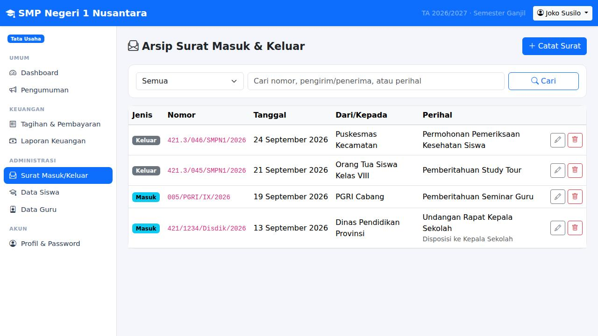

### Lainnya

- **Laporan Keuangan** — lihat bagian Kepala Sekolah.
- **Data Siswa** — tombol 🧾 langsung membuka tagihan siswa tersebut.
- **Pengumuman** — Tata Usaha dapat membuat pengumuman (mis. info pembayaran untuk orang tua) dan
  hanya dapat mengubah pengumuman buatannya sendiri.

---

## Guru

| Menu | Kegunaan |
|---|---|
| **Dashboard** | Jadwal mengajar hari ini, jumlah kelas & mapel yang diampu |
| **Jadwal Mengajar** | Daftar mapel yang diampu dan jadwal mingguan |
| **Input Absensi** | Absensi harian kelas yang diajar |
| **Input Nilai** | Nilai Tugas, UTS, dan UAS per kelas & mapel |

### Jadwal Mengajar

Tombol **Nilai** dan **Absensi** di setiap baris langsung membuka halaman input untuk kelas tersebut.

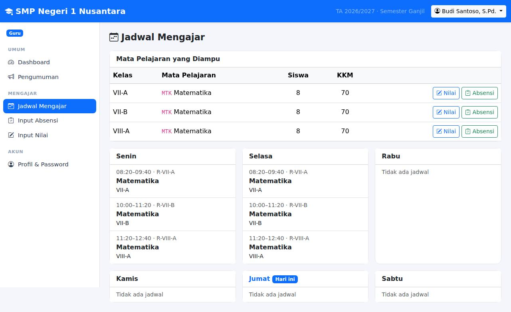

### Input Absensi

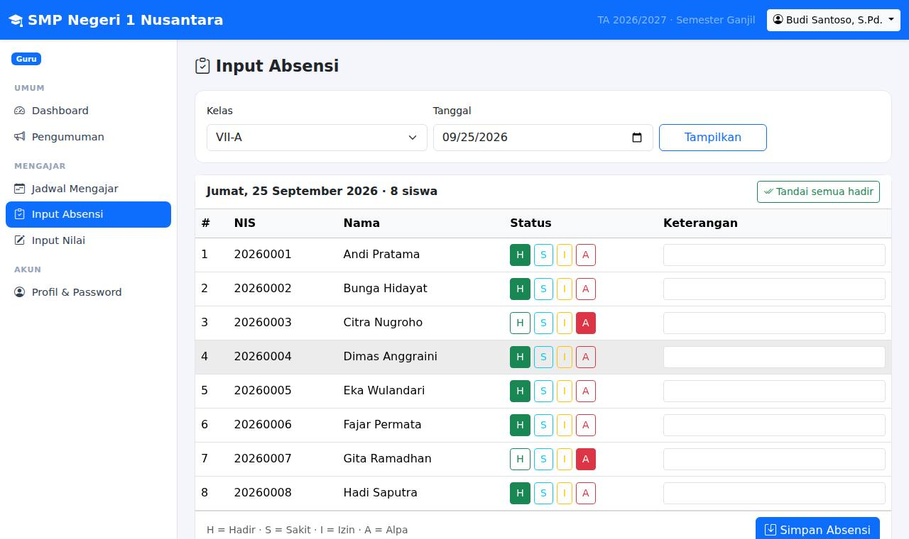

1. Pilih **kelas** dan **tanggal** (default hari ini; tanggal yang akan datang tidak diizinkan) → **Tampilkan**.
2. Klik status setiap siswa: **H** Hadir, **S** Sakit, **I** Izin, **A** Alpa. Tombol
   **Tandai semua hadir** mempercepat pengisian.
3. Isi keterangan bila perlu → **Simpan Absensi**.

Absensi bisa diubah kapan saja dengan membuka tanggal yang sama. Satu siswa memiliki satu status per hari.

### Input Nilai

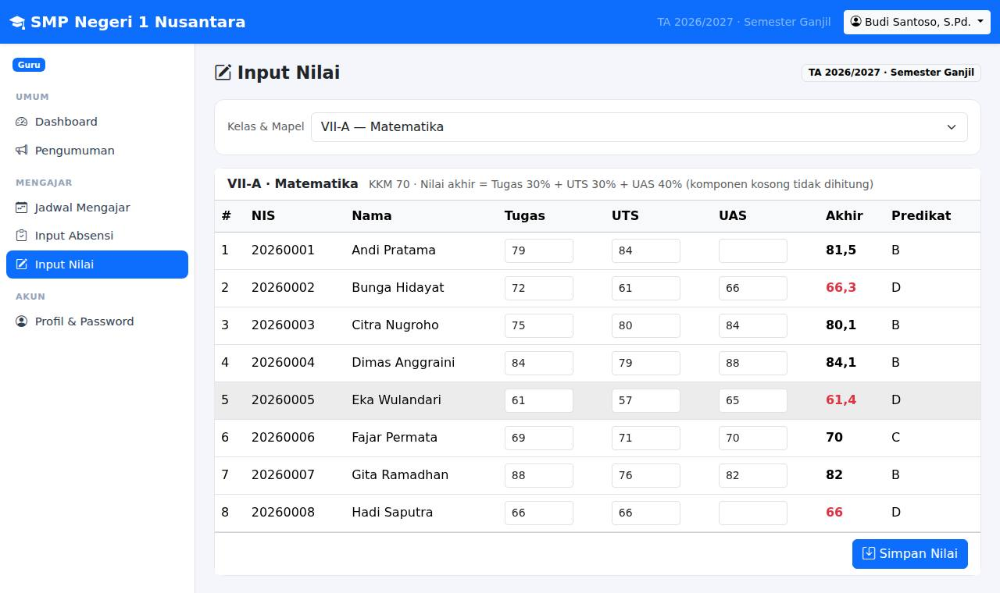

1. Pilih **kelas & mata pelajaran**.
2. Isi nilai **Tugas**, **UTS**, dan **UAS** (0–100, desimal diperbolehkan). Kolom boleh dikosongkan dulu.
3. **Simpan Nilai**. Nilai akhir & predikat dihitung otomatis; nilai merah berarti di bawah KKM.

Nilai disimpan untuk **tahun ajaran & semester aktif** yang tampil di kanan atas.

---

## Wali Kelas

Wali Kelas memiliki semua menu **Guru**, ditambah menu **Perwalian** untuk kelas yang diwalikannya.

| Menu | Kegunaan |
|---|---|
| **Siswa Kelas Saya** | Daftar siswa, kontak orang tua, rekap H/S/I/A semester ini (alpa ≥ 3 ditandai merah), tunggakan, tombol rapor |
| **Rekap Absensi** | Tabel absensi bulanan (tanggal 1–31) per siswa beserta totalnya |
| **Rekap Nilai** | Nilai akhir semua mapel per siswa, rata-rata, dan **peringkat kelas** |
| **Catatan Rapor** | Catatan/motivasi wali kelas untuk setiap siswa, tampil di rapor |

**Siswa Kelas Saya**

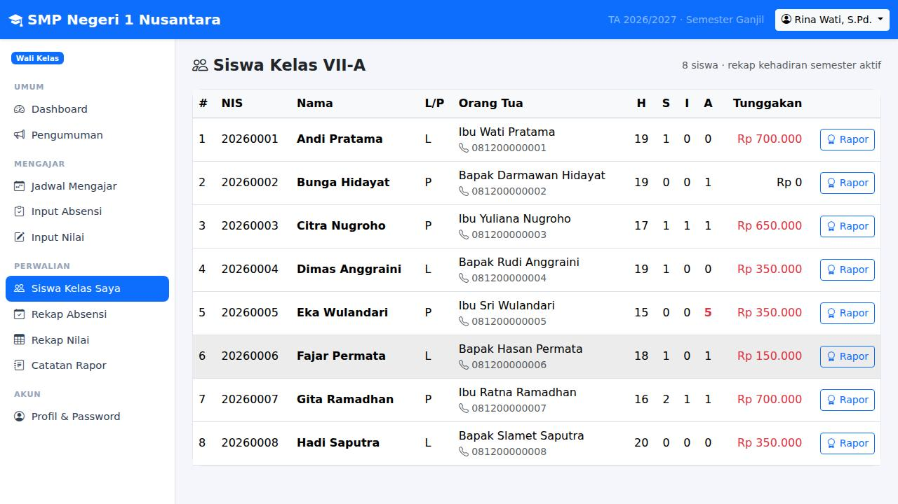

**Rekap Absensi** — pilih bulan, lalu 🖨 untuk mencetak.

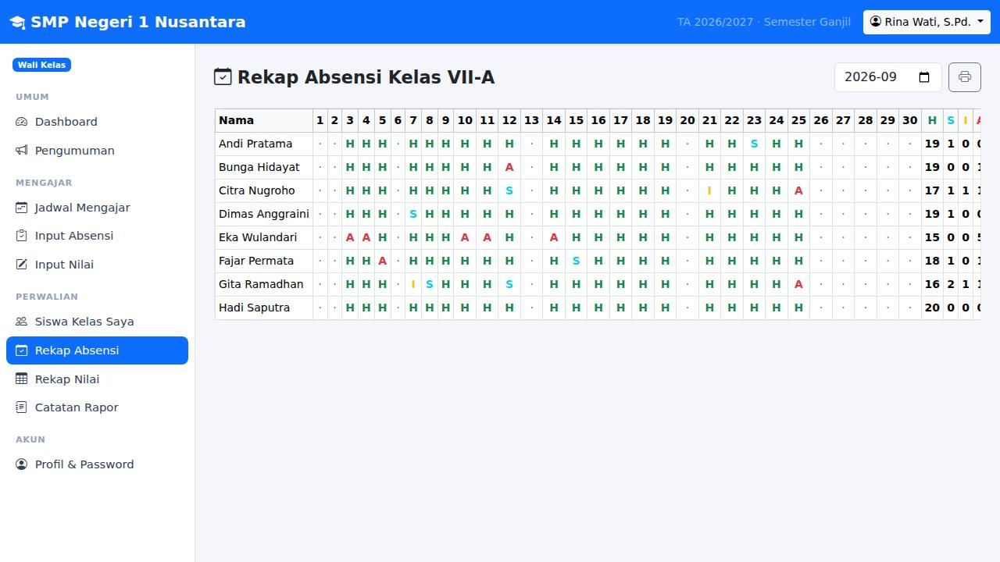

**Rekap Nilai**

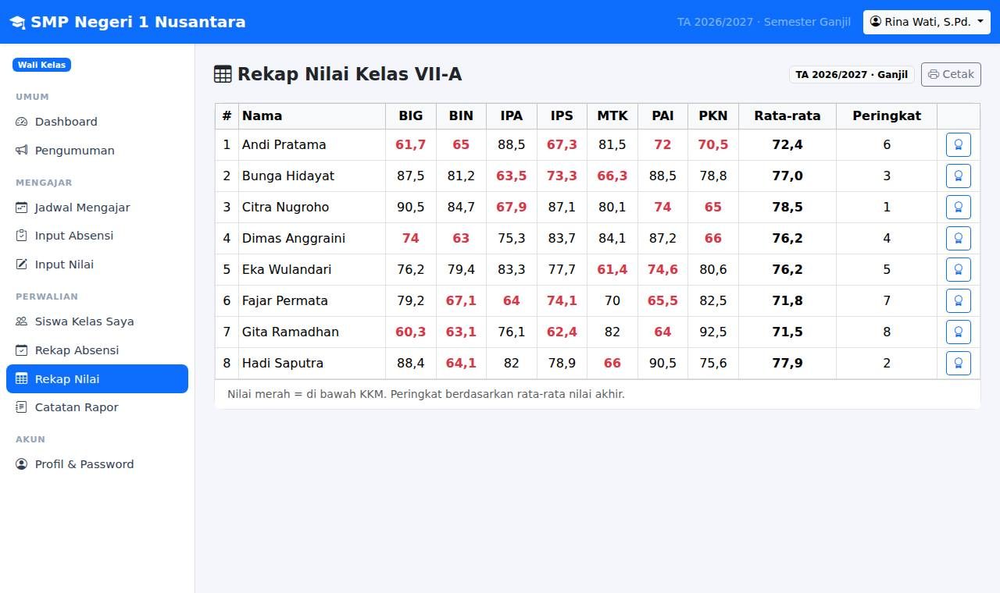

**Catatan Rapor** — tulis catatan untuk setiap siswa, lalu **Simpan Catatan**.

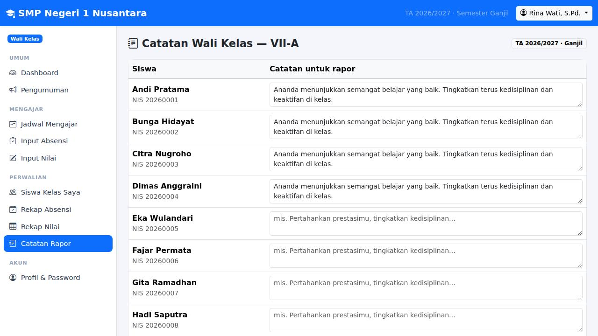

**Mencetak rapor:** **Siswa Kelas Saya** → tombol **Rapor** → **Cetak**. Rapor memuat nilai semua mapel,
predikat, status tuntas, ketidakhadiran, catatan wali kelas, dan kolom tanda tangan.

> Wali kelas hanya dapat membuka rapor siswa di kelas perwaliannya.

---

## Murid

| Menu | Isi |
|---|---|
| **Dashboard** | Rata-rata nilai, jumlah hadir, sakit/izin/alpa semester ini, tunggakan, jadwal hari ini |
| **Jadwal Pelajaran** | Jadwal mingguan kelas |
| **Nilai & Rapor** | Rapor semester aktif; semester sebelumnya bisa dipilih di kanan atas; dapat dicetak |
| **Kehadiran** | Rekap semester dan riwayat kehadiran per tanggal |
| **Tagihan Sekolah** | Daftar tagihan, status, sisa, riwayat pembayaran, dan cetak kwitansi |

Murid hanya dapat melihat datanya sendiri. Pembayaran dilakukan melalui bagian Tata Usaha.

**Jadwal Pelajaran** — hari ini ditandai *Hari ini*.

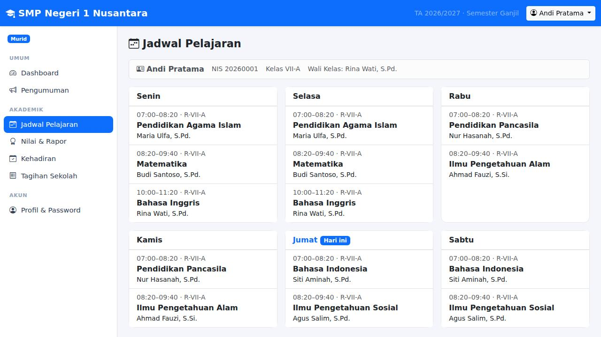

**Kehadiran**

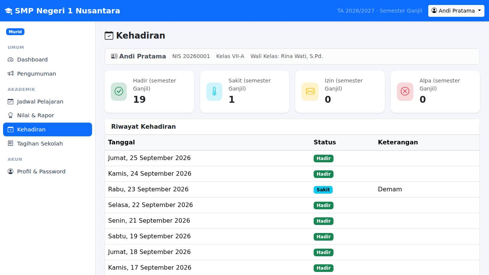

**Tagihan Sekolah** — klik **Kwitansi** untuk mencetak bukti pembayaran.

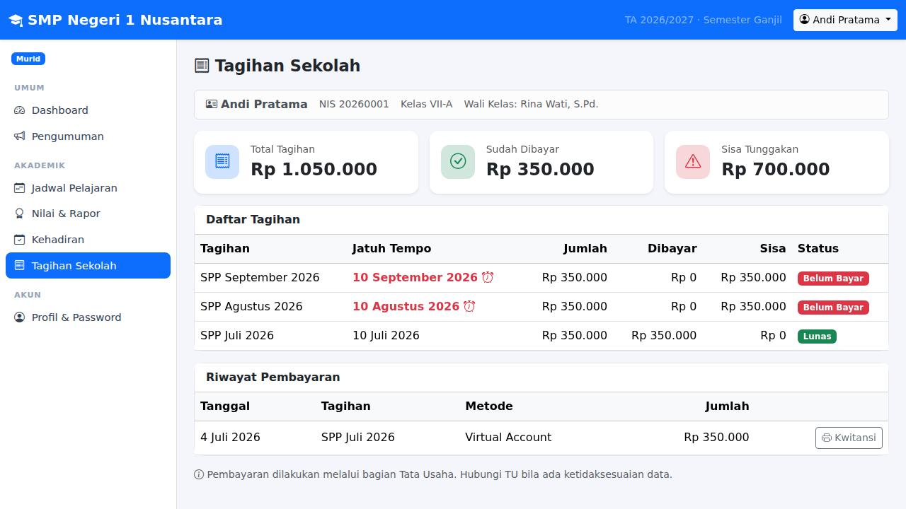

---

## Orang Tua Murid

Orang tua melihat informasi yang sama seperti murid, yaitu dashboard, jadwal, nilai & rapor, kehadiran,
dan tagihan, **untuk anaknya**.

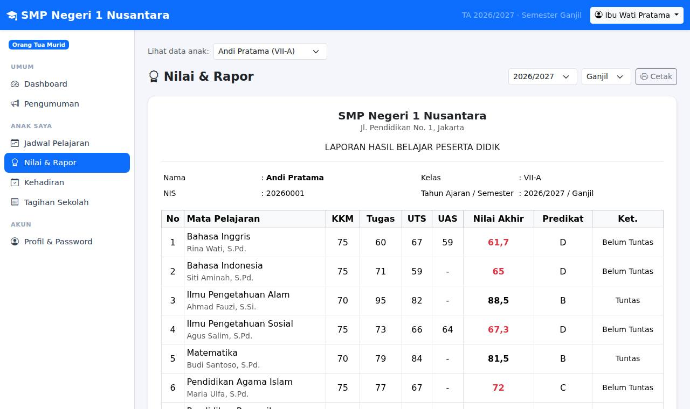

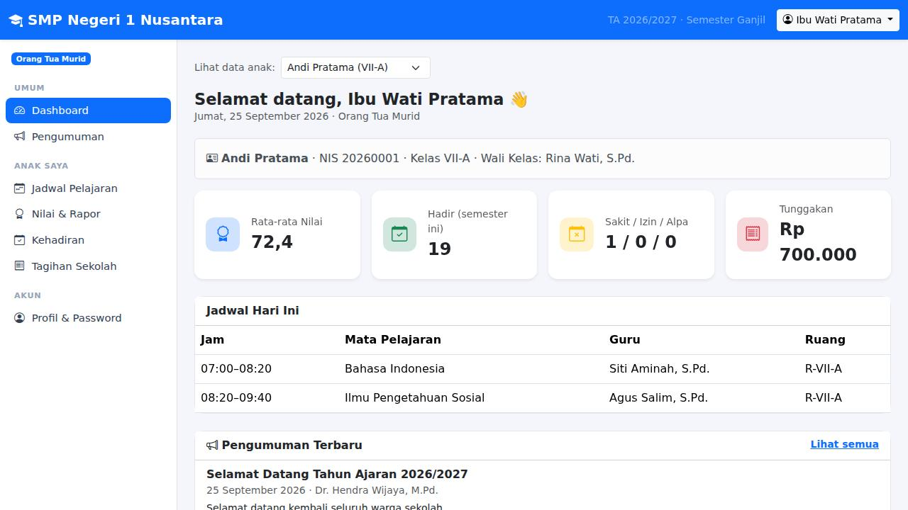

- Bila memiliki **lebih dari satu anak** di sekolah, pilih anak pada kotak **"Lihat data anak"** di bagian atas
  halaman. Pilihan ini berlaku untuk semua menu hingga diganti.
- Pengumuman khusus orang tua (mis. informasi SPP, rapat komite) tampil di menu **Pengumuman**.
- Hubungi wali kelas (nama tertera di dashboard & rapor) atau Tata Usaha bila ada ketidaksesuaian data.

---

## Aturan Penilaian

| Aturan | Nilai |
|---|---|
| Bobot nilai akhir | Tugas 30% · UTS 30% · UAS 40% |
| Komponen kosong | Tidak dihitung sebagai 0; bobot dibagi ke komponen yang sudah terisi. Contoh: Tugas 80, UTS 70, UAS kosong → (80×30 + 70×30) / 60 = **75** |
| Predikat | **A** ≥ 90 · **B** ≥ 80 · **C** ≥ 70 · **D** < 70 |
| Ketuntasan | *Tuntas* bila nilai akhir ≥ KKM mata pelajaran |
| Peringkat kelas | Berdasarkan rata-rata nilai akhir seluruh mapel |
| Periode semester (untuk rekap kehadiran) | Ganjil: 1 Juli – 31 Desember · Genap: 1 Januari – 30 Juni |

Bobot dapat diubah oleh pengelola server di `config.php` (`grade_weights`).

---

## Pertanyaan Umum

**Saya lupa password.**
Hubungi bagian Administrasi. Admin dapat mengatur password baru di **Pengguna → ✏ (ubah) → Password**.

**Menu yang saya butuhkan tidak ada.**
Menu mengikuti peran akun. Misalnya menu *Perwalian* hanya untuk peran **Wali Kelas** yang sudah
ditetapkan pada sebuah kelas. Hubungi Administrasi untuk menyesuaikan peran.

**Muncul "Sesi formulir telah kedaluwarsa".**
Halaman terlalu lama terbuka. Muat ulang halaman, lalu isi dan kirim kembali formulir.

**Nilai tidak muncul di rapor.**
Pastikan guru menyimpan nilai pada tahun ajaran & semester yang sama dengan yang dipilih di rapor.

**Guru tidak bisa memilih kelas di Input Absensi.**
Guru hanya dapat mengisi absensi untuk kelas yang diajarnya (lihat **Penugasan Guru**) atau kelas
perwaliannya.

---

Lihat juga: [Instalasi di cPanel](INSTALASI-CPANEL.md) · [Dokumentasi Teknis](DOKUMENTASI-TEKNIS.md) · [README](../README.md)
